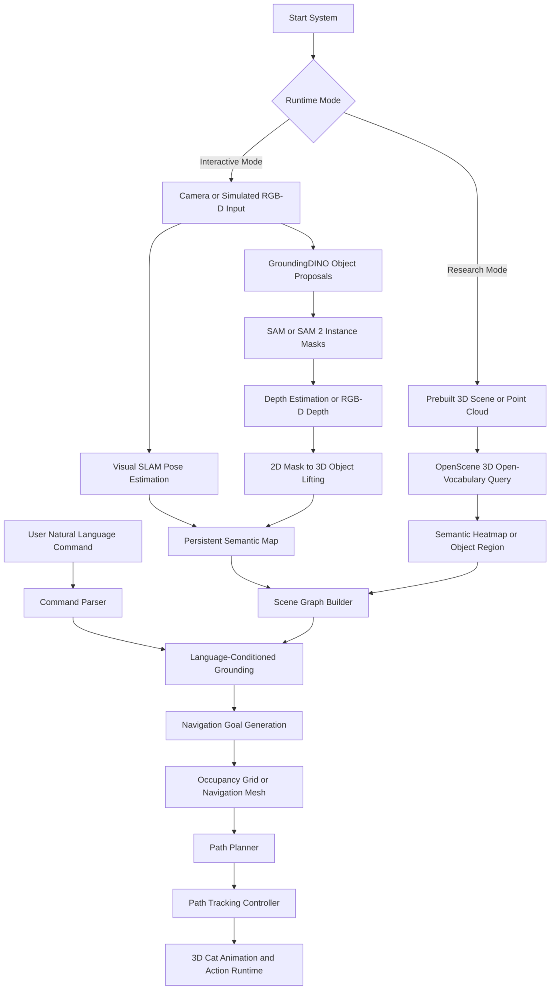
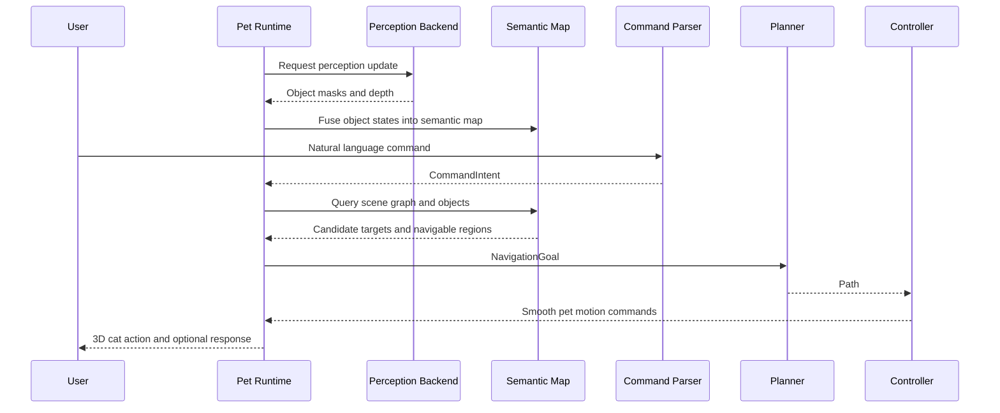

# Software Design Specification: Language-Guided Semantic Mapping and Navigation for a 3D Embodied Pet Agent

> Iterative SSD/SDD. Each phase builds on the previous phase. Implement in order.  
> Project codename: `semantic-pet-agent`  
> Primary character: 3D cat pet  
> Primary goal: build a technically grounded 3D embodied pet that can perceive objects, build a semantic map, understand natural language commands, plan feasible paths, and perform pet-like behaviors in a 3D environment.

---

## Table of Contents

1. [Project Overview](#1-project-overview)
   - [1.1 Goal](#11-goal)
   - [1.2 Non-Goals](#12-non-goals)
   - [1.3 Core Technical Claim](#13-core-technical-claim)
   - [1.4 Course Integration](#14-course-integration)
   - [1.5 Overall Execution Flow](#15-overall-execution-flow)
2. [Technical Direction and Feasibility Analysis](#2-technical-direction-and-feasibility-analysis)
   - [2.1 GroundingDINO + SAM/SAM 2 Backend](#21-groundingdino--samsam-2-backend)
   - [2.2 OpenScene Backend](#22-openscene-backend)
   - [2.3 Visual SLAM Backend](#23-visual-slam-backend)
   - [2.4 Navigation and Control Backend](#24-navigation-and-control-backend)
   - [2.5 Recommended Architecture Decision](#25-recommended-architecture-decision)
3. [System Architecture](#3-system-architecture)
   - [3.1 Layered Architecture](#31-layered-architecture)
   - [3.2 Runtime Modes](#32-runtime-modes)
   - [3.3 Module Responsibilities](#33-module-responsibilities)
   - [3.4 Data Flow](#34-data-flow)
4. [Data Contracts](#4-data-contracts)
5. [Phase 1: 3D Pet Runtime and Manual Control](#5-phase-1-3d-pet-runtime-and-manual-control)
6. [Phase 2: Open-Vocabulary Perception Backend](#6-phase-2-open-vocabulary-perception-backend)
7. [Phase 3: Depth Lifting and Object-Level 3D Representation](#7-phase-3-depth-lifting-and-object-level-3d-representation)
8. [Phase 4: Scene Graph and Language-Conditioned Grounding](#8-phase-4-scene-graph-and-language-conditioned-grounding)
9. [Phase 5: Visual SLAM and Persistent Semantic Map](#9-phase-5-visual-slam-and-persistent-semantic-map)
10. [Phase 6: Occupancy Grid, Navigation Mesh, and Path Planning](#10-phase-6-occupancy-grid-navigation-mesh-and-path-planning)
11. [Phase 7: Path Tracking Control and Pet Motion](#11-phase-7-path-tracking-control-and-pet-motion)
12. [Phase 8: Exploration and Active Perception](#12-phase-8-exploration-and-active-perception)
13. [Phase 9: LLM Task Planning and Clarification Dialog](#13-phase-9-llm-task-planning-and-clarification-dialog)
14. [Phase 10: Optional RL-Based Exploration Policy](#14-phase-10-optional-rl-based-exploration-policy)
15. [Phase 11: Optional OpenScene Research Backend](#15-phase-11-optional-openscene-research-backend)
16. [Phase 12: Dual-Backend Evaluation and Demo Packaging](#16-phase-12-dual-backend-evaluation-and-demo-packaging)
17. [Recommended Development Timeline](#17-recommended-development-timeline)
18. [Testing and Evaluation Plan](#18-testing-and-evaluation-plan)
19. [Repository Structure](#19-repository-structure)
20. [Configuration Files](#20-configuration-files)
21. [Risks and Cut Rules](#21-risks-and-cut-rules)
22. [Appendix A: Course Topic Mapping](#22-appendix-a-course-topic-mapping)
23. [Appendix B: Reference Models and Frameworks](#23-appendix-b-reference-models-and-frameworks)

---

## 1. Project Overview

### 1.1 Goal

Build a 3D embodied pet system, represented as a virtual cat, that can:

- Observe a real or simulated environment through camera input.
- Detect and segment objects using natural language prompts.
- Lift 2D detections into an approximate or metric 3D representation.
- Maintain a persistent semantic map of objects and navigable regions.
- Understand user commands such as:
  - `Go to the red cup.`
  - `Hide behind the keyboard.`
  - `Avoid the mouse.`
  - `Explore the desk and tell me what you found.`
- Plan a feasible path toward the target.
- Execute pet-like motion with smooth control instead of teleporting.
- Ask clarification when the scene or command is ambiguous.
- Provide an optional research mode for 3D open-vocabulary scene querying.

The final deliverable should include a runnable system, a demo video, evaluation logs, and a technical report explaining the system architecture, model choices, failure cases, and course-related theory.

### 1.2 Non-Goals

This project should not attempt to solve all robotics and embodied AI problems at once.

Out of scope for the main track:

- Training a foundation vision-language model from scratch.
- Training a full RL navigation policy as the default controller.
- Building a physical robot as the primary deliverable.
- Achieving centimeter-level 3D localization with a monocular camera.
- Making OpenScene the real-time interactive backbone.
- Making the LLM directly output low-level movement commands per frame.

These features may be added as optional extensions after the main system is stable.

### 1.3 Core Technical Claim

The core contribution is more than using many pretrained models. The system contribution is:

> Convert open-vocabulary perception outputs into a persistent, queryable semantic map, then use language-conditioned grounding, navigation planning, and control to drive an embodied 3D pet agent.

The engineering depth should come from:

- Object-centric 3D state estimation.
- Persistent semantic map maintenance.
- Scene graph construction.
- Language-conditioned spatial grounding.
- Navigation planning.
- Path tracking control.
- Ambiguity handling and failure recovery.
- Quantitative evaluation.

### 1.4 Course Integration

The project is designed to align with the graduate-level course **Robotic Navigation and Exploration**.

Course topics and corresponding project modules:

| Course Topic | Project Integration |
|---|---|
| Kinematic model | Pet movement model, speed limit, turning radius, action constraints |
| PID control | Smooth pet following, path tracking, animation velocity control |
| Pure pursuit control | Path following for the 3D cat or optional mobile robot |
| Motion planning | A*, navigation mesh, occupancy grid path planning |
| Reinforcement learning | Optional exploration behavior or preference policy |
| Probability and Bayes filter | Object state uncertainty and temporal filtering |
| Kalman / Extended Kalman Filter | Optional smoothing of object positions and pet pose |
| Graph optimization / SLAM backend | Persistent camera pose and semantic map construction |
| 3D SLAM | Visual SLAM or RGB-D mapping backend |
| Object detection and semantic segmentation | GroundingDINO + SAM/SAM 2 perception backend |
| 3D embodied agent | Final system framing and demo |
| VLM and LLM-driven planning | Command parser, task planner, clarification dialog |
| Preference-based RL and VLM rewards | Optional policy learning extension |

### 1.5 Overall Execution Flow



---

## 2. Technical Direction and Feasibility Analysis

### 2.1 GroundingDINO + SAM/SAM 2 Backend

GroundingDINO is used for open-vocabulary object proposal generation. It accepts human language inputs such as category names or referring expressions and outputs bounding boxes for objects matching the prompt.

SAM or SAM 2 is used for promptable segmentation. GroundingDINO provides object boxes; SAM/SAM 2 refines those boxes into masks. SAM 2 is preferred for video or stream-based interaction because it supports promptable segmentation in images and videos and includes memory for video tracking.

#### Strengths

- Strong fit for real-time or near-real-time interactive demos.
- Can start from ordinary RGB camera input.
- Easy to inspect intermediate outputs: boxes, masks, confidence, depth, object states.
- Works well with user commands such as `cup`, `keyboard`, `red box`, and `object near the mouse`.
- Modular and replaceable.
- Supports phased development.

#### Weaknesses

- It is primarily a 2D perception pipeline.
- 3D position must be derived through depth lifting.
- Monocular depth may provide relative depth, not precise metric scale.
- Cross-frame identity tracking must be implemented or integrated.
- Spatial relations such as behind, near, left of, right of, and occluding require custom reasoning logic.

#### Main Use in This Project

GroundingDINO + SAM/SAM 2 is the main perception backend for the interactive system.

### 2.2 OpenScene Backend

OpenScene is a zero-shot 3D scene understanding method that embeds dense 3D point features into a language-compatible feature space. It enables open-vocabulary queries over 3D scenes.

#### Strengths

- More aligned with true 3D open-vocabulary scene understanding.
- Can answer free-form semantic queries over a prebuilt 3D scene.
- Good research component for showing AI and 3D semantic understanding depth.
- Useful for comparing 2D-to-3D lifted object maps against 3D semantic feature fields.

#### Weaknesses

- Requires 3D scene data, posed images, point clouds, or reconstructed scenes.
- Data preparation and environment setup are more complex.
- Less suitable as the first real-time interactive backend.
- Navigation and control still need separate implementation.
- Debugging is harder because intermediate feature fields are less transparent than boxes and masks.

#### Main Use in This Project

OpenScene is an optional research backend and comparison module. It should not block the interactive 3D pet deliverable.

### 2.3 Visual SLAM Backend

Visual SLAM estimates camera pose and builds a map from visual observations. For this project, SLAM is used to give the 3D pet a persistent spatial memory.

Potential options:

- ORB-SLAM2 or ORB-SLAM3 for visual SLAM experiments.
- RGB-D camera-based pose and map building if hardware is available.
- Simulation-provided pose for early development.
- Approximate camera-pose-free 3D layout for MVP fallback.

#### Strengths

- Gives object detections a persistent world coordinate frame.
- Allows the cat to remember objects outside the current camera view.
- Supports exploration and revisiting behavior.
- Connects directly to the course topics: Bayes filtering, graph optimization, multi-view geometry, and 3D SLAM.

#### Weaknesses

- Monocular SLAM scale ambiguity can harm metric navigation.
- Feature-based SLAM may fail on textureless or dynamic scenes.
- Integration with deep perception modules requires coordinate synchronization.
- Full SLAM integration may become a time sink.

#### Main Use in This Project

Use simulated pose or RGB-D first. Integrate visual SLAM after the perception and 3D object representation are working.

### 2.4 Navigation and Control Backend

The navigation backend converts grounded goals into feasible movement. The control backend executes paths smoothly.

Possible implementations:

- A* on a 2D occupancy grid.
- Navigation mesh over a desk or floor plane.
- Pure pursuit controller.
- PID-based velocity smoothing.
- Optional ROS 2 Nav2 integration for advanced extension.

#### Strengths

- Makes the cat behave as an embodied agent with motion constraints.
- Avoids teleport-like behavior.
- Gives measurable metrics: path length, collision count, success rate.
- Directly maps to the course topics on kinematic models, path tracking, motion planning, and action control.

#### Weaknesses

- Requires a clean representation of navigable and blocked regions.
- If the 3D map is noisy, planning quality degrades.
- Full ROS integration can increase complexity.

#### Main Use in This Project

Implement a lightweight navigation stack first. Keep ROS 2 Nav2 as an optional physical robot or advanced simulation extension.

### 2.5 Recommended Architecture Decision

Use a dual-track architecture:

```text
Main Track:
  GroundingDINO + SAM/SAM 2
  -> Depth lifting
  -> Object-level semantic map
  -> Scene graph
  -> Path planning
  -> Path tracking
  -> 3D cat behavior

Research Track:
  OpenScene
  -> 3D open-vocabulary query
  -> Semantic heatmap/object region
  -> Compare with main track
```

The main track guarantees a working interactive system. The research track demonstrates deeper understanding of open-vocabulary 3D scene understanding.

---

## 3. System Architecture

### 3.1 Layered Architecture

```text
Layer 1: Input Layer
  Camera, RGB-D stream, saved video, simulation sensor, keyboard/manual control

Layer 2: Perception Layer
  GroundingDINO, SAM/SAM 2, optional YOLO fast mode, depth estimation

Layer 3: Localization and Mapping Layer
  Camera pose, visual SLAM, object fusion, persistent semantic map

Layer 4: Scene Understanding Layer
  Scene graph, object relations, navigable regions, affordance labels

Layer 5: Language and Planning Layer
  Command parsing, target grounding, ambiguity handling, task planning

Layer 6: Navigation and Control Layer
  Goal selection, occupancy grid, path planning, pure pursuit, PID smoothing

Layer 7: Pet Runtime Layer
  3D cat model, animations, emotions, reactions, UI overlay

Layer 8: Evaluation Layer
  Logs, metrics, replay, failure case analysis
```

### 3.2 Runtime Modes

| Mode | Description | Priority |
|---|---|---|
| `manual_3d_pet` | User manually moves cat in 3D runtime | Required |
| `perception_debug` | Visualize boxes, masks, depth, object states | Required |
| `interactive_semantic_nav` | Full main pipeline with natural language and navigation | Required |
| `exploration` | Cat explores and updates semantic map | Recommended |
| `research_openscene` | OpenScene-based 3D query comparison | Optional |
| `rl_exploration` | RL-based exploration preference policy | Optional |
| `ros_bridge` | Export goals to ROS 2 or physical robot | Optional |

### 3.3 Module Responsibilities

| Module | Responsibility |
|---|---|
| `InputManager` | Manage camera, video, or simulated sensor input |
| `GroundingBackend` | Generate language-conditioned object proposals |
| `SegmentationBackend` | Generate instance masks |
| `DepthBackend` | Produce depth map or read RGB-D depth |
| `ObjectLifter` | Convert 2D masks and depth into 3D object states |
| `Tracker` | Maintain object identity across frames |
| `SLAMAdapter` | Estimate camera pose or read simulated pose |
| `SemanticMap` | Store object states, map cells, confidence, and timestamps |
| `SceneGraphBuilder` | Build object relations and spatial topology |
| `CommandParser` | Convert natural language commands into structured intent |
| `GroundingResolver` | Resolve target objects or regions from command and map |
| `Planner` | Generate path to target |
| `Controller` | Track path with smooth motion |
| `PetRuntime` | Render and animate the cat |
| `Evaluator` | Store metrics and generate reports |

### 3.4 Data Flow



---

## 4. Data Contracts

### 4.1 FramePacket

```json
{
  "frame_id": 128,
  "timestamp": 1710000000.123,
  "rgb_path": "runs/session_001/frames/000128.png",
  "depth_path": "runs/session_001/depth/000128.npy",
  "camera_intrinsics": {
    "fx": 615.0,
    "fy": 615.0,
    "cx": 320.0,
    "cy": 240.0
  },
  "camera_pose_world": {
    "available": true,
    "position": [0.0, 1.2, 0.4],
    "quaternion": [0.0, 0.0, 0.0, 1.0]
  }
}
```

### 4.2 ObjectState

```json
{
  "object_id": "cup_001",
  "class_label": "cup",
  "attributes": ["red"],
  "bbox_xyxy": [410, 210, 510, 390],
  "mask_path": "runs/session_001/masks/cup_001_000128.png",
  "confidence": 0.79,
  "center_2d": [460, 300],
  "center_3d_world": [0.42, 0.74, 1.26],
  "extent_3d": [0.12, 0.18, 0.12],
  "median_depth": 1.26,
  "depth_uncertainty": 0.08,
  "last_seen_frame": 128,
  "tracking_status": "tracked",
  "source_backend": "groundingdino_sam2"
}
```

### 4.3 SceneGraph

```json
{
  "graph_id": "scene_001_f128",
  "nodes": [
    {
      "object_id": "cup_001",
      "class_label": "cup",
      "attributes": ["red"],
      "confidence": 0.79
    }
  ],
  "edges": [
    {
      "subject": "cup_001",
      "relation": "right_of",
      "object": "keyboard_001",
      "score": 0.82
    },
    {
      "subject": "cup_001",
      "relation": "in_front_of",
      "object": "monitor_001",
      "score": 0.76
    }
  ]
}
```

### 4.4 SemanticMap

```json
{
  "map_id": "session_001_map",
  "coordinate_frame": "world",
  "objects": ["cup_001", "keyboard_001", "mouse_001"],
  "occupancy_grid": {
    "resolution": 0.05,
    "origin": [-2.0, -2.0],
    "width": 80,
    "height": 80,
    "data_path": "runs/session_001/maps/occupancy.npy"
  },
  "navigable_regions": [
    {
      "region_id": "desk_surface_001",
      "type": "surface",
      "polygon": [[0.0, 0.0], [1.2, 0.0], [1.2, 0.8], [0.0, 0.8]]
    }
  ],
  "last_updated": 1710000000.123
}
```

### 4.5 CommandIntent

```json
{
  "raw_text": "貓貓，躲到紅色杯子後面，不要靠近滑鼠",
  "intent_type": "hide",
  "target": {
    "class_label": "cup",
    "attributes": ["red"]
  },
  "spatial_relation": {
    "type": "behind",
    "anchor": "target"
  },
  "constraints": [
    {
      "type": "avoid",
      "object": {
        "class_label": "mouse"
      }
    }
  ],
  "fallback": "ask_clarification"
}
```

### 4.6 NavigationGoal

```json
{
  "goal_id": "goal_001",
  "goal_type": "pose",
  "target_position_world": [0.55, 0.72, 1.10],
  "target_orientation_hint": "face_user",
  "constraints": [
    {
      "type": "avoid_object",
      "object_id": "mouse_001",
      "min_distance": 0.25
    }
  ],
  "source_command": "貓貓，躲到紅色杯子後面，不要靠近滑鼠"
}
```

### 4.7 PetAction

```json
{
  "action_id": "action_001",
  "action_type": "move_follow_path",
  "animation": "walk",
  "path": [
    [0.10, 0.30, 1.00],
    [0.20, 0.42, 1.00],
    [0.55, 0.72, 1.10]
  ],
  "speed": 0.35,
  "emotion": "curious",
  "speech": "我去杯子後面躲起來。"
}
```

### 4.8 EvaluationRecord

```json
{
  "trial_id": "trial_023",
  "scene_id": "desk_scene_005",
  "command": "go to the red cup",
  "target_object_gt": "cup_red_001",
  "predicted_target": "cup_red_001",
  "grounding_success": true,
  "path_success": true,
  "collision_count": 0,
  "task_success": true,
  "latency_ms": 742,
  "notes": "Depth uncertainty low; clean mask."
}
```

---

## 5. Phase 1: 3D Pet Runtime and Manual Control

### 5.1 Goal

Create a controllable 3D cat runtime before adding AI perception.

### 5.2 Requirements

- Render a 3D cat model in a desktop or simulation environment.
- Support manual movement commands.
- Support basic animations:
  - idle
  - walk
  - run
  - look
  - sit
  - hide
  - confused
- Log cat pose and action state.
- Implement coordinate frame conventions.

### 5.3 Recommended Stack

Choose one:

| Stack | Strength | Weakness |
|---|---|---|
| Unity | Strong 3D runtime and animation ecosystem | C# integration overhead |
| Godot | Lightweight and open-source | Fewer AI integration examples |
| Three.js | Easy web demo and Vue integration | More work for animation and physics |
| Python + Open3D/PyGame | Simple for experiments | Weaker final presentation |

Recommended for this project:

```text
Primary: Unity or Three.js
Backend: Python FastAPI or WebSocket perception server
```

### 5.4 Interface

```bash
python backend/server.py --mode manual_3d_pet
npm run dev
```

or

```bash
python backend/server.py --mode manual_3d_pet
unity-project/SemanticPetAgent
```

### 5.5 Acceptance Criteria

- User can move the cat manually.
- Cat pose is represented in world coordinates.
- Cat animation state changes according to action type.
- Runtime can receive JSON action messages from backend.

---

## 6. Phase 2: Open-Vocabulary Perception Backend

### 6.1 Goal

Detect and segment objects using natural language prompts.

### 6.2 Requirements

- Accept RGB frame and text prompts.
- Run GroundingDINO to produce bounding boxes.
- Run SAM or SAM 2 to produce instance masks.
- Store results as `ObjectState`.
- Provide debug visualization:
  - RGB frame
  - bounding boxes
  - masks
  - labels
  - confidence
- Support a prompt list:
  - cup
  - bottle
  - keyboard
  - mouse
  - monitor
  - chair
  - table
  - box
  - notebook
  - human hand

### 6.3 Optional Fast Mode

Implement YOLO segmentation or detection as a fast fallback. This is useful when open-vocabulary detection is too slow.

### 6.4 Interface

```bash
python backend/perception/run_perception.py \
  --image data/samples/desk_001.jpg \
  --prompts "cup.keyboard.mouse.bottle.box"
```

### 6.5 Output

```json
{
  "frame_id": 1,
  "objects": [
    {
      "object_id": "cup_tmp_001",
      "class_label": "cup",
      "bbox_xyxy": [410, 210, 510, 390],
      "confidence": 0.79,
      "mask_path": "outputs/masks/cup_tmp_001.png"
    }
  ]
}
```

### 6.6 Acceptance Criteria

- At least 5 common desk objects can be detected in sample images.
- Instance masks are saved and visualized.
- Failed detections are logged without crashing the system.
- Runtime latency is recorded.

---

## 7. Phase 3: Depth Lifting and Object-Level 3D Representation

### 7.1 Goal

Convert 2D object masks into approximate or metric 3D object states.

### 7.2 Requirements

- Support one of the following depth sources:
  - RGB-D camera depth.
  - Simulation depth.
  - Monocular depth estimation.
- Compute object depth statistics from mask pixels.
- Use median depth instead of mean depth.
- Estimate object 3D centroid.
- Estimate object extent if enough points are available.
- Store depth uncertainty.
- Visualize lifted 3D object centers.

### 7.3 2D to 3D Projection

For each pixel `(u, v)` with depth `Z`:

```text
X = (u - cx) * Z / fx
Y = (v - cy) * Z / fy
Z = depth(u, v)
```

If camera pose is available, transform camera-frame points into world-frame points.

### 7.4 Logic Flow

```text
for each object mask:
    collect valid depth pixels inside mask
    remove outliers using percentile filtering
    compute median depth
    project mask pixels to 3D
    compute 3D centroid
    estimate uncertainty
    update ObjectState
```

### 7.5 Acceptance Criteria

- Each detected object has `center_3d_world` or `center_3d_camera`.
- Depth uncertainty is recorded.
- Objects with too few depth pixels are rejected or marked low confidence.
- Debug view shows object centers in 3D.

---

## 8. Phase 4: Scene Graph and Language-Conditioned Grounding

### 8.1 Goal

Build a scene graph and resolve natural language commands to target objects or target regions.

### 8.2 Requirements

- Construct object nodes from `ObjectState`.
- Construct spatial relation edges:
  - left_of
  - right_of
  - in_front_of
  - behind
  - near
  - far_from
  - above
  - below
  - occluding
  - on_surface
- Parse user commands into `CommandIntent`.
- Resolve target objects using:
  - class match
  - attribute match
  - spatial relation match
  - confidence
  - feasibility
- Ask clarification when target confidence is low.

### 8.3 Relation Scoring

Example scoring:

```text
score(target | command)
= 0.35 * semantic_match
+ 0.20 * attribute_match
+ 0.25 * relation_match
+ 0.10 * visibility_score
+ 0.10 * navigation_feasibility
```

### 8.4 Example

Command:

```text
貓貓，走到紅色杯子右邊
```

Output:

```json
{
  "intent_type": "move_to",
  "target_object_id": "cup_001",
  "relation": "right_of",
  "navigation_goal": {
    "target_position_world": [0.65, 0.70, 1.10]
  }
}
```

### 8.5 Acceptance Criteria

- At least 20 predefined commands can be parsed.
- Spatial relations work on at least 10 desk scenes.
- Ambiguous commands trigger clarification instead of random action.
- Scene graph can be exported as JSON.

---

## 9. Phase 5: Visual SLAM and Persistent Semantic Map

### 9.1 Goal

Maintain persistent spatial memory across frames and camera movement.

### 9.2 Requirements

- Integrate one pose source:
  - simulation pose
  - RGB-D odometry
  - ORB-SLAM2/ORB-SLAM3 output
  - manually calibrated fixed-camera pose
- Fuse object detections across frames.
- Maintain persistent object identities.
- Store object states even when objects leave the current view.
- Track confidence decay for stale objects.
- Support map reset and map save/load.

### 9.3 Object Fusion Logic

```text
for each new ObjectState:
    find existing object candidates by class label
    compute 3D distance
    compute visual/mask similarity if available
    compute temporal consistency
    if match score > threshold:
        update existing object
    else:
        create new object
```

### 9.4 Semantic Map Update

```text
object.position = alpha * new_position + (1 - alpha) * old_position
object.confidence = update_confidence(object.confidence, detection_confidence)
object.last_seen_frame = current_frame
```

### 9.5 Acceptance Criteria

- Same object can be tracked across at least 50 frames.
- Object remains in map after leaving camera view.
- Stale objects are marked with lower confidence.
- Map can be saved and replayed.

---

## 10. Phase 6: Occupancy Grid, Navigation Mesh, and Path Planning

### 10.1 Goal

Generate feasible paths for the 3D cat.

### 10.2 Requirements

- Build a 2D occupancy grid or navigation mesh from:
  - desk/floor plane
  - object masks
  - lifted 3D obstacles
  - manually defined walkable regions
- Mark blocked cells around obstacles.
- Generate target points from grounded commands.
- Plan paths using A* or Dijkstra.
- Support constraints:
  - avoid object
  - stay on surface
  - keep distance from object
  - approach from left/right/front/behind
- Provide path visualization.

### 10.3 Occupancy Grid

```json
{
  "resolution": 0.05,
  "origin": [-2.0, -2.0],
  "width": 80,
  "height": 80,
  "blocked_cells": [[12, 15], [12, 16], [13, 15]],
  "free_cells": [[10, 10], [10, 11]]
}
```

### 10.4 Path Planning Logic

```text
start = current_cat_position
goal = navigation_goal.target_position_world

if goal is occupied:
    search nearest free cell around goal

path = AStar(start, goal, occupancy_grid)

if path not found:
    return failure reason and ask user for alternative
```

### 10.5 Acceptance Criteria

- Cat can plan path to target object without crossing obstacles.
- Planner returns failure reason when no path exists.
- Planned path is shown in debug view.
- At least 80% success on manually constructed test scenes.

---

## 11. Phase 7: Path Tracking Control and Pet Motion

### 11.1 Goal

Make the cat follow planned paths smoothly.

### 11.2 Requirements

- Implement a simple kinematic model for the cat.
- Use PID or pure pursuit style path tracking.
- Add speed, acceleration, and turning limits.
- Convert controller outputs into animation state.
- Avoid foot sliding or sudden teleporting.
- Support interruption by new commands.

### 11.3 Control Model

```text
state:
  position = [x, y, z]
  heading = theta
  speed = v

control:
  target_speed
  angular_velocity
```

### 11.4 Pure Pursuit Style Logic

```text
lookahead_point = find point on path at lookahead distance
heading_error = angle_to(lookahead_point) - current_heading
angular_velocity = Kp * heading_error
speed = clamp(base_speed, min_speed, max_speed)
```

### 11.5 Acceptance Criteria

- Cat follows a path with smooth turns.
- Cat does not teleport during normal navigation.
- Cat stops within a threshold distance of the target.
- Control logs include speed, heading error, path progress, and final error.

---

## 12. Phase 8: Exploration and Active Perception

### 12.1 Goal

Allow the cat to explore unknown or low-confidence regions.

### 12.2 Requirements

- Maintain observed and unobserved regions.
- Define exploration goals:
  - inspect unknown region
  - search for object
  - verify stale object
  - look behind obstacle
- Select next viewpoint using a heuristic.
- Update semantic map after exploration.
- Report findings to the user.

### 12.3 Example Command

```text
貓貓，幫我看看桌上有什麼。
```

Expected behavior:

```text
1. Cat identifies observed and unobserved areas.
2. Cat moves through reachable viewpoints.
3. System updates semantic map.
4. Cat reports detected objects.
```

### 12.4 Exploration Heuristic

```text
viewpoint_score
= 0.40 * expected_new_area
+ 0.25 * semantic_uncertainty
+ 0.20 * object_search_relevance
- 0.15 * travel_cost
```

### 12.5 Acceptance Criteria

- Cat can select at least one meaningful exploration goal.
- Semantic map is updated after movement.
- System reports newly discovered objects.
- Exploration can be canceled by user.

---

## 13. Phase 9: LLM Task Planning and Clarification Dialog

### 13.1 Goal

Use an LLM as a high-level task planner and dialog manager, not as a low-level controller.

### 13.2 Requirements

- Convert natural language into structured `CommandIntent`.
- Generate clarification questions.
- Explain failure causes.
- Generate high-level plans:
  - inspect
  - move_to
  - hide
  - avoid
  - follow
  - search
  - report
- Enforce schema validation on LLM output.
- Provide rule-based fallback for common commands.

### 13.3 Example LLM Output

```json
{
  "intent_type": "search",
  "target": {
    "class_label": "keys",
    "attributes": []
  },
  "constraints": [
    {
      "type": "search_area",
      "area": "desk"
    }
  ],
  "fallback": "report_not_found"
}
```

### 13.4 Safety Rule

The LLM must never directly output per-frame velocity commands. It only produces structured high-level intent. The navigation and control stack executes motion.

### 13.5 Acceptance Criteria

- Invalid LLM output is rejected by schema validation.
- At least 20 commands work through rule-based fallback.
- Ambiguous commands produce clarification questions.
- The system can explain at least 5 failure types.

---

## 14. Phase 10: Optional RL-Based Exploration Policy

### 14.1 Goal

Add RL only as an optional exploration or preference module.

### 14.2 Recommended Scope

RL should not replace the baseline path planner. Use it for:

- Choosing exploration targets.
- Learning pet-like preferences.
- Selecting behavior style.
- Learning when to inspect uncertain objects.

### 14.3 State

```json
{
  "known_object_count": 5,
  "unknown_area_ratio": 0.42,
  "target_visible": false,
  "distance_to_frontier": 1.3,
  "semantic_uncertainty": 0.27
}
```

### 14.4 Actions

```text
inspect_frontier
move_to_known_object
look_around
ask_user
return_to_user
```

### 14.5 Reward Design

```text
+1.0 discovered relevant object
+0.5 reduced unknown area
+0.3 verified stale object
-0.2 unnecessary movement
-1.0 collision
-0.5 repeated failed inspection
```

### 14.6 Acceptance Criteria

- RL module can run in a simulation or offline replay.
- Baseline heuristic remains available.
- RL performance is compared against heuristic exploration.
- If training is unstable, cut this phase and keep it as analysis.

---

## 15. Phase 11: Optional OpenScene Research Backend

### 15.1 Goal

Add a research mode for open-vocabulary 3D scene query.

### 15.2 Requirements

- Load a prebuilt 3D scene or point cloud.
- Run OpenScene or equivalent 3D open-vocabulary query backend.
- Accept text queries:
  - chair
  - desk
  - soft
  - place to hide
  - object near table
- Output a 3D relevance heatmap or candidate region.
- Compare with main track object-level semantic map.

### 15.3 Research Comparison

| Metric | Main Track | OpenScene Track |
|---|---|---|
| Data requirement | RGB/RGB-D stream | Prebuilt 3D scene or point cloud |
| Runtime suitability | Higher | Lower |
| Query flexibility | Object-level | Dense 3D semantic feature-level |
| Debuggability | Higher | Medium |
| Best use | Interactive pet | Research demo and comparison |

### 15.4 Acceptance Criteria

- At least one prebuilt scene can be queried.
- Query result is visualized in 3D.
- Comparison report explains when OpenScene wins or fails.
- This phase must not block the main interactive demo.

---

## 16. Phase 12: Dual-Backend Evaluation and Demo Packaging

### 16.1 Goal

Package the project into a complete deliverable.

### 16.2 Required Demo Scenarios

1. **Object navigation**
   - Command: `Go to the red cup.`
   - Expected: cat finds red cup and walks near it.

2. **Spatial relation**
   - Command: `Hide behind the keyboard.`
   - Expected: cat selects a region behind the keyboard and moves there.

3. **Avoidance**
   - Command: `Go to the bottle but avoid the mouse.`
   - Expected: cat plans a path around the mouse.

4. **Exploration**
   - Command: `Explore the desk and tell me what you found.`
   - Expected: cat moves through viewpoints and reports object list.

5. **Clarification**
   - Command: `Go to the cup` when multiple cups exist.
   - Expected: cat asks which cup.

6. **Persistent memory**
   - Object leaves current view.
   - Expected: map still contains object with decayed confidence.

7. **Research mode**
   - Query a prebuilt scene with OpenScene.
   - Expected: system shows 3D semantic relevance map.

### 16.3 Output Artifacts

- `spec.md`
- `README.md`
- `requirements.txt` or `environment.yml`
- Demo video
- Architecture diagram
- Evaluation report
- Failure case report
- Sample logs
- Sample scenes

---

## 17. Recommended Development Timeline

### 17.1 8-Week Minimum Plan

| Week | Goal | Deliverable |
|---|---|---|
| 1 | 3D pet runtime | Cat can move manually in 3D |
| 2 | Perception backend | GroundingDINO + SAM/SAM 2 debug output |
| 3 | Depth lifting | ObjectState with 3D centroid |
| 4 | Scene graph and command parser | Language command resolves to target |
| 5 | Semantic map | Objects persist across frames |
| 6 | Path planning | Cat plans route to object |
| 7 | Path tracking and behavior | Cat moves smoothly and avoids obstacles |
| 8 | Demo, evaluation, packaging | Demo video and report |

### 17.2 12-Week Strong Plan

| Week | Goal | Deliverable |
|---|---|---|
| 1-2 | Runtime and perception | Manual cat + object masks |
| 3 | Depth and 3D object states | 2D-to-3D lifting |
| 4 | Scene graph | Spatial relations |
| 5 | Command grounding | Natural language target resolution |
| 6 | Semantic map | Persistent object memory |
| 7 | Planner | Occupancy grid and A* |
| 8 | Controller | Smooth pet movement |
| 9 | Exploration | Active perception behavior |
| 10 | LLM task planner | Structured intent and clarification |
| 11 | OpenScene research mode | 3D query comparison |
| 12 | Evaluation and demo | Final presentation |

---

## 18. Testing and Evaluation Plan

### 18.1 Unit Tests

| Component | Tests |
|---|---|
| CommandParser | Commands parse to valid schema |
| GroundingResolver | Correct target chosen from scene graph |
| ObjectLifter | 2D mask + depth produces valid 3D centroid |
| SceneGraphBuilder | Relations computed correctly |
| Planner | Finds path around obstacles |
| Controller | Follows path within error threshold |
| SemanticMap | Fuses repeated detections correctly |

### 18.2 Integration Tests

| Test | Description |
|---|---|
| Perception to map | Detected objects become persistent objects |
| Command to action | User command produces pet action |
| Planner to controller | Planned path is executed smoothly |
| Exploration loop | Cat explores and updates map |
| Clarification loop | Ambiguous target produces question |

### 18.3 Evaluation Metrics

| Metric | Definition |
|---|---|
| Object detection success | Correct target object appears in proposals |
| Segmentation quality | Mask visually overlaps target object |
| 3D localization error | Distance between predicted and approximate ground truth |
| Relation accuracy | Correct left/right/front/behind/near relation |
| Grounding accuracy | Correct target selected from command |
| Path success rate | Path reaches target without collision |
| Collision count | Number of blocked-cell violations |
| Task success rate | End-to-end command completed |
| Average latency | Command-to-action delay |
| Clarification precision | Clarification asked only when needed |
| Map persistence | Object remembered after leaving view |

### 18.4 Evaluation Dataset

Create a small custom benchmark:

```text
scenes/
  desk_001/
  desk_002/
  desk_003/
  room_001/
  room_002/

commands/
  object_navigation.json
  spatial_relation.json
  avoidance.json
  exploration.json
  ambiguity.json
```

Minimum evaluation set:

- 10 scenes.
- 50 commands.
- 5 ambiguity cases.
- 5 object disappearance cases.
- 5 no-target cases.

---

## 19. Repository Structure

```text
semantic-pet-agent/
  README.md
  spec.md
  requirements.txt
  environment.yml
  configs/
    default.yaml
    perception.yaml
    navigation.yaml
    llm.yaml
    evaluation.yaml
  backend/
    server.py
    input/
      camera.py
      video.py
      simulation.py
    perception/
      grounding_dino_backend.py
      sam_backend.py
      sam2_backend.py
      yolo_fast_backend.py
      depth_backend.py
    mapping/
      object_lifter.py
      slam_adapter.py
      semantic_map.py
      tracker.py
    scene/
      scene_graph.py
      relation_rules.py
    language/
      command_parser.py
      schema_validator.py
      grounding_resolver.py
    navigation/
      occupancy_grid.py
      nav_mesh.py
      astar.py
      planner.py
    control/
      pure_pursuit.py
      pid.py
      motion_smoother.py
    pet/
      action_schema.py
      behavior_planner.py
    research/
      openscene_adapter.py
      backend_comparison.py
    evaluation/
      metrics.py
      replay.py
      report.py
  frontend/
    web/
    unity/
  data/
    samples/
    scenes/
    commands/
  runs/
    session_001/
  docs/
    architecture.md
    demo_plan.md
    failure_cases.md
```

---

## 20. Configuration Files

### 20.1 `configs/default.yaml`

```yaml
runtime:
  mode: interactive_semantic_nav
  device: cuda
  target_fps: 10
  log_dir: runs/session_001

input:
  source: webcam
  camera_id: 0
  width: 640
  height: 480

perception:
  grounding_backend: groundingdino
  segmentation_backend: sam2
  depth_backend: rgbd_or_monocular
  prompts:
    - cup
    - bottle
    - keyboard
    - mouse
    - monitor
    - box
    - notebook
    - chair
    - table
  detection_threshold: 0.30
  mask_min_area: 200

mapping:
  pose_source: fixed_or_slam
  object_fusion_distance: 0.25
  stale_decay_rate: 0.95
  min_object_confidence: 0.35

navigation:
  planner: astar
  grid_resolution: 0.05
  obstacle_padding: 0.10
  goal_tolerance: 0.08

control:
  controller: pure_pursuit
  lookahead_distance: 0.20
  max_speed: 0.35
  max_angular_speed: 1.2
  pid:
    kp: 1.0
    ki: 0.0
    kd: 0.05

language:
  parser: llm_with_rule_fallback
  schema_validation: true
  ask_clarification_threshold: 0.60

research:
  openscene_enabled: false
```

### 20.2 `configs/evaluation.yaml`

```yaml
evaluation:
  dataset_dir: data/eval
  output_dir: runs/eval
  metrics:
    - object_detection_success
    - grounding_accuracy
    - relation_accuracy
    - path_success_rate
    - collision_count
    - task_success_rate
    - latency_ms
```

---

## 21. Risks and Cut Rules

### 21.1 Technical Risks

| Risk | Impact | Mitigation |
|---|---|---|
| GroundingDINO too slow | Low FPS | Add YOLO fast mode or cache detections |
| SAM 2 integration unstable | Tracking failure | Fall back to SAM per-frame masks |
| Monocular depth inaccurate | Bad 3D map | Use RGB-D, simulation depth, or relative-depth mode |
| SLAM integration too hard | Persistent map delayed | Use fixed camera or simulation pose first |
| Occupancy grid noisy | Bad path planning | Use manual walkable region in MVP |
| LLM output invalid | Runtime errors | Enforce JSON schema and fallback parser |
| RL training unstable | Time loss | Keep RL optional |
| OpenScene preprocessing complex | Project blocked | Keep OpenScene after main demo |
| Animation integration slow | Weak presentation | Use simple cat model and focus on motion correctness |

### 21.2 Cut Rules

If time is limited, cut in this order:

1. RL-based exploration.
2. OpenScene research backend.
3. ROS 2 bridge.
4. Full visual SLAM.
5. Advanced cat animations.
6. Multi-room mapping.

Do not cut:

1. Perception debug output.
2. ObjectState schema.
3. Scene graph.
4. Basic path planning.
5. Pet runtime.
6. Evaluation logs.

### 21.3 Minimum Viable Demo

The minimum acceptable demo is:

```text
Camera or sample scene
-> GroundingDINO + SAM/SAM 2 detects and segments objects
-> Depth lifting creates object-level 3D states
-> User command selects target object
-> Cat plans path on a simple occupancy grid
-> Cat moves smoothly to target
-> System logs success/failure
```

---

## 22. Appendix A: Course Topic Mapping

| Course Week | Topic | Direct Project Usage |
|---|---|---|
| 1 | Introduction to Robotic Navigation and Exploration | Overall framing and final report |
| 2 | Kinematic Model and Path Tracking Control | Cat motion model, PID, pure pursuit |
| 3 | Motion Planning | A*, trajectory planning, obstacle avoidance |
| 4 | Reinforcement Learning I | Define MDP for optional exploration |
| 5 | Reinforcement Learning II | Optional DQN or policy-gradient extension |
| 6 | Project Environment Building | Dev environment, simulator, camera pipeline |
| 8 | SLAM Back-end I | Bayes filtering, uncertainty, state estimation |
| 9 | SLAM Back-end II | Graph optimization and semantic map persistence |
| 10 | 3D SLAM I | Camera model, feature descriptor, multi-view geometry |
| 11 | 3D SLAM II | ORB-SLAM, direct methods, DNN-based SLAM |
| 12 | 3D Embodied Agent I | 2D to 3D to interactive embodied intelligence |
| 13 | 3D Embodied Agent II | VLM, LLM planning, preference-based RL |
| 14-16 | Paper and Project Presentation | OpenScene comparison, final demo |

---

## 23. Appendix B: Reference Models and Frameworks

### B.1 GroundingDINO

Use as the open-vocabulary detector. It is appropriate when the user command names objects by natural language.

### B.2 SAM / SAM 2

Use for instance mask generation and video segmentation. SAM 2 is preferred for stream-based tracking.

### B.3 OpenScene

Use as optional research backend for open-vocabulary 3D scene query.

### B.4 ORB-SLAM2 / ORB-SLAM3

Use as optional visual SLAM backend for camera pose and sparse reconstruction.

### B.5 ROS 2 Nav2

Use as reference architecture for planner, controller, localization, and navigation stack design. Full integration is optional.

### B.6 Habitat

Use as a conceptual or optional simulation reference for embodied AI and navigation tasks.

---

## Final Implementation Strategy

The main project should be implemented in this order:

```text
3D pet runtime
-> perception backend
-> depth lifting
-> scene graph
-> command grounding
-> semantic map
-> planning
-> control
-> exploration
-> LLM planner
-> optional OpenScene
-> optional RL
```

The strongest final narrative is:

> This project builds a language-guided 3D embodied pet agent that combines open-vocabulary visual perception, semantic mapping, spatial reasoning, and navigation control. GroundingDINO + SAM/SAM 2 provides the interactive perception backbone, SLAM-inspired mapping gives the agent persistent spatial memory, and planning/control modules convert language-grounded goals into smooth pet behavior. OpenScene and RL are included as optional research extensions for deeper 3D semantic understanding and exploration policy learning.
