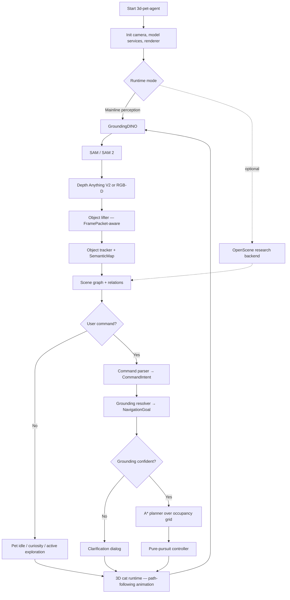
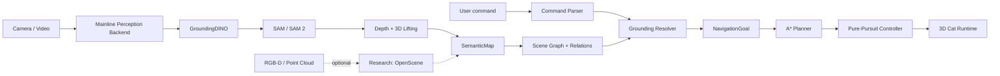

# Software Design Document: `3d-pet-agent` (v2)

> Iterative SDD. Each phase builds on the previous one. Implement in order.
>
> **Project theme.** A language-grounded, navigable 3D computer pet. The pet
> perceives objects through a camera, maintains a persistent semantic map of
> the scene, grounds natural-language commands into spatial targets, and
> executes pet-like motion using occupancy-grid planning and a pure-pursuit
> controller — rather than teleporting.
>
> **Technical positioning.** GroundingDINO + SAM/SAM 2 is the interactive
> perception mainline. ORB-SLAM-style visual SLAM, OpenScene-style 3D semantic
> querying, and RL-based exploration are *optional research extensions* — they
> deepen the narrative and align with course topics but are never on the
> critical path of the interactive demo.
>
> **Course alignment.** The phases align with a graduate "Robotic Navigation
> and Exploration" syllabus — kinematic model, PID, pure pursuit, A* /
> Dijkstra, occupancy grids, Bayes filtering, graph SLAM, 3D SLAM,
> open-vocabulary detection and segmentation, VLM/LLM planning, and
> preference-based RL all map to specific phases (see [Appendix A](#appendix-a-course-topic-mapping)).

---

## Changelog from v1

v1 (preserved in git history before this commit) had 10 phases focused on
perception → scene graph → behavior planner → OpenScene → eval. v2 keeps the
perception backbone but promotes robotics-navigation modules to first-class
mainline phases and demotes research backends to optional extensions.

- **Phase order restructured** so navigation (occupancy + A*) and control
  (pure pursuit + kinematic model) become first-class mainline phases, not a
  single vague "behavior planner".
- **`FramePacket`, `SemanticMap`, `NavigationGoal`** added as data contracts;
  they were implicit in v1 and are now explicit.
- **`PetAction` upgraded to path-following** (`move_follow_path` with a
  `path[]` waypoint list). The legacy `move_to` action is retained for
  direct manual commands.
- **Visual SLAM, OpenScene, RL, ROS 2 Nav2 bridge** are tagged as
  *optional* — each lives in `§14`, not in the main phase order.
- **Coordinate-frame policy clarified**: `world` is the default but is
  produced by a swappable `pose_source ∈ {fixed, sim, slam}`. Phase 3+
  works under all three.

---

## Table of Contents

1. [Project Overview](#1-project-overview)
2. [Architecture](#2-architecture)
3. [Data Contracts](#3-data-contracts)
4. [Phase 1 — 3D Pet Runtime and Sandbox](#4-phase-1--3d-pet-runtime-and-sandbox)
5. [Phase 2 — Open-Vocabulary Perception](#5-phase-2--open-vocabulary-perception)
6. [Phase 3 — Depth Lifting and FramePacket](#6-phase-3--depth-lifting-and-framepacket)
7. [Phase 4 — Object Tracking and SemanticMap](#7-phase-4--object-tracking-and-semanticmap)
8. [Phase 5 — Scene Graph and Spatial Relations](#8-phase-5--scene-graph-and-spatial-relations)
9. [Phase 6 — Command Parsing and Grounding Resolver](#9-phase-6--command-parsing-and-grounding-resolver)
10. [Phase 7 — Occupancy Grid and A\* Path Planning](#10-phase-7--occupancy-grid-and-a-path-planning)
11. [Phase 8 — Pure-Pursuit Controller and Path Following](#11-phase-8--pure-pursuit-controller-and-path-following)
12. [Phase 9 — Active Exploration](#12-phase-9--active-exploration)
13. [Phase 10 — Evaluation and Demo Packaging](#13-phase-10--evaluation-and-demo-packaging)
14. [Optional Extensions](#14-optional-extensions)
15. [Configuration](#15-configuration)
16. [Testing Strategy](#16-testing-strategy)
17. [Risks and Cut Rules](#17-risks-and-cut-rules)
18. [Recommended Development Schedule](#18-recommended-development-schedule)
19. [Appendix A — Course Topic Mapping](#appendix-a-course-topic-mapping)
20. [Appendix B — Reference Models and Frameworks](#appendix-b-reference-models-and-frameworks)

---

## 1. Project Overview

### 1.1 Goal

Build a 3D embodied pet system named `3d-pet-agent`. The system takes live RGB
or RGB-D input plus natural-language commands, identifies objects in the real
environment, lifts them to a persistent 3D semantic map, grounds commands such
as "walk behind the red cup" or "hide between the keyboard and the box", plans
a feasible path, and drives a 3D cat avatar to follow that path with smooth
control.

```text
Go to the right side of the red cup.
Hide behind the keyboard.
Do not get close to the water bottle.
Look at the object I just placed on the table.
Find a safe place between the mouse and the box.
Which object are you looking at?
Explore the desk and tell me what you found.
```

Core engineering claim:

```text
Convert open-vocabulary perception outputs into a persistent, queryable
semantic map, then use language-conditioned grounding, navigation planning,
and pure-pursuit control to drive an embodied 3D pet agent.
```

### 1.2 Scope

The project focuses on seven engineering problems:

1. Open-vocabulary visual grounding from text prompts.
2. Instance-level segmentation for object masks.
3. 3D lifting from masks and depth.
4. Persistent semantic map with object identity across frames.
5. Object-centric scene graph with spatial relations.
6. Occupancy-grid-based path planning.
7. Smooth pet motion via pure pursuit + kinematic constraints.

Optional research extensions (each in its own appendix section, not blocking
the demo):

```text
Visual SLAM (ORB-SLAM2/3, RGB-D odometry)
OpenScene-style open-vocabulary 3D scene understanding
RL-based exploration policy
ROS 2 Nav2 bridge (for physical-robot extensions)
```

### 1.3 Non-Goals

The project does **not**:

- Train a foundation vision-language model from scratch.
- Promise centimeter-level metric reconstruction with monocular depth alone.
- Build a physical robot as the primary deliverable.
- Make OpenScene the first or only perception backbone.
- Call an LLM every frame. Language parsing is event-driven on user commands;
  perception, tracking, and control run as independent loops at their own
  rates.
- Use RL as the default controller. RL is restricted to *exploration policy*
  in the optional track; planning + control remain classical.

### 1.4 Target Hardware

| Component | Target |
|---|---|
| GPU | NVIDIA RTX 4070 (12 GB VRAM) — sized for `grounding-dino-tiny` + `sam-vit-base` + Depth Anything V2 Small running concurrently |
| CPU | Intel Core i7-10700, 8 cores / 16 threads |
| RAM | 32 GB recommended |
| Camera | Webcam, phone stream, or optional RGB-D |
| OS | Linux primary; Windows via WSL2 secondary |
| Renderer | Three.js in browser (Vue 3 + Vite + TS) |
| Backend | Python + FastAPI + WebSocket |

VRAM budget assumes mixed-precision where the model supports it, with
GroundingDINO running fp32 (deformable attention internally mixes dtypes — see
§17.1).

### 1.5 Technical Positioning

The project should be presented as **systems engineering for an embodied
agent**, not as a model-training paper.

```text
Open-vocabulary perception
  → instance masks
  → uncertainty-aware 3D object lifting
  → persistent semantic map  (Phase 4)
  → scene graph + relations  (Phase 5)
  → command grounding        (Phase 6)
  → A* path planning         (Phase 7) ← classical robotics
  → pure-pursuit control     (Phase 8) ← classical robotics
  → active exploration       (Phase 9)
  → quantitative evaluation  (Phase 10)
```

Phases 7–8 are where the *robotics-navigation* identity of the project lives;
Phases 4–6 are where the *language-grounded perception* identity lives.

### 1.6 Overall Execution Flow



---

## 2. Architecture

### 2.1 Layered View

```text
Layer 1: Input               webcam / video / RGB-D / sim sensor
Layer 2: Perception          GroundingDINO · SAM/SAM 2 · Depth Anything V2
Layer 3: Localization & Map  pose source (fixed / sim / SLAM)
                             object lifter · tracker · SemanticMap
Layer 4: Scene understanding scene graph · spatial relations · navigable region
Layer 5: Language & Planning command parser · grounding resolver · clarification
Layer 6: Navigation          occupancy grid · A* planner · NavigationGoal
Layer 7: Control             kinematic model · pure pursuit · PID smoothing
Layer 8: Pet Runtime         3D cat · animations · emotions · speech overlay
Layer 9: Evaluation          metrics · replay · failure cases · reports
```

Layers 6–7 are the navigation + control stack newly promoted in v2. Layer 3
gains an explicit "pose source" abstraction so `fixed` (camera at origin),
`sim` (simulator-provided pose), and `slam` (ORB-SLAM) are interchangeable.

### 2.2 Dual-Backend Architecture



### 2.3 Module Responsibilities

| Module | Layer | Responsibility |
|---|---|---|
| `camera_service` | 1 | Capture RGB(-D) frames; emit FramePackets |
| `perception/detector` | 2 | GroundingDINO open-vocabulary boxes |
| `perception/segmenter` | 2 | SAM/SAM 2 instance masks |
| `perception/depth` | 2 | Monocular or RGB-D depth |
| `perception/pipeline` | 2 | Orchestrator: detector → segmenter → ObjectCandidate2D |
| `spatial/pose_source` | 3 | Provide camera pose (fixed / sim / slam) |
| `spatial/object_lifter` | 3 | 2D mask + depth + pose → 3D ObjectState |
| `tracking/tracker` | 3 | Cross-frame object identity (IoU → ByteTrack) |
| `spatial/semantic_map` | 3 | Persistent ObjectState fusion + occupancy slice |
| `spatial/scene_graph` | 4 | Object relations: left/right/front/behind/near/between |
| `language/command_parser` | 5 | NL → CommandIntent (rule fallback + optional LLM) |
| `planning/grounding_resolver` | 5 | CommandIntent + SemanticMap → NavigationGoal |
| `planning/occupancy_grid` | 6 | 2D occupancy from SemanticMap + obstacle padding |
| `planning/astar` | 6 | A*/Dijkstra over occupancy grid |
| `control/kinematic` | 7 | Cat motion model (speed/turn limits) |
| `control/pure_pursuit` | 7 | Lookahead-based path tracking |
| `control/pid` | 7 | Velocity smoothing |
| `runtime/pet_runtime` | 8 | Authoritative PetState + action broadcast |
| `runtime/websocket_server` | 8 | FastAPI app, /ws/pet, HTTP control surface |
| `research/openscene_backend` | opt | 3D open-vocabulary query backend |
| `research/rl_explorer` | opt | RL exploration policy |
| `research/slam_adapter` | opt | ORB-SLAM2/3 wrapper |
| `evaluation/*` | 9 | Datasets, metrics, replays, reports |

### 2.4 Runtime Modes

| Mode | Description | Required |
|---|---|---|
| `sandbox` | 3D pet runtime alone, no perception | ✓ (Phase 1) |
| `snapshot` | Detection + segmentation on a single image | ✓ (Phase 2) |
| `perception_debug` | Live perception, no behavior | ✓ (Phase 2–3) |
| `demo` | Full mainline + path-following | ✓ (Phase 7–8) |
| `replay` | Pipeline on recorded RGB(-D) + commands | ✓ (Phase 10) |
| `eval` | Benchmark commands over recorded scenes | ✓ (Phase 10) |
| `exploration` | Active exploration without target | recommended |
| `openscene_static` | OpenScene query on prepared 3D scene | optional |
| `compare_backends` | Mainline vs OpenScene on same query | optional |
| `rl_exploration` | RL-driven exploration policy | optional |
| `ros_bridge` | Export goals to ROS 2 Nav2 | optional |

CLI examples:

```bash
python main.py --mode sandbox
python main.py --mode sandbox --target 0.5 0.0 1.2
python main.py --mode sandbox --script samples/pet_actions.jsonl
python main.py --mode snapshot --image samples/desk.jpg --command "go to the red cup"
python main.py --mode demo --camera 0 --prompts configs/prompts.txt
python main.py --mode replay --video samples/desk.mp4 --commands samples/commands.jsonl
python main.py --mode eval --dataset eval/desk_queries.jsonl
python main.py --mode openscene_static --scene data/scene_01 --query "chair"
```

### 2.5 Update Rates

Per `configs/runtime.yaml`:

| Loop | Rate |
|---|---|
| Perception (detector + segmenter + depth) | 2 Hz |
| Tracking + SemanticMap fusion | 10 Hz |
| Control (pure pursuit) | 30 Hz |
| Renderer | 60 Hz |
| Command parser | event-driven |

These loops are independent — never block one on another. The renderer
consumes the latest PetAction broadcast; the controller produces those
broadcasts at its own rate based on the planned path.

---

## 3. Data Contracts

All payloads use JSON. Schemas are validated by Pydantic on the Python side
and TypeScript types on the frontend side. **These contracts are the stable
interface between modules** — extend rather than replace.

### 3.1 `FramePacket`

A single sensor frame with everything needed for 3D reasoning.

```json
{
  "frame_id": 128,
  "timestamp": 1710000000.123,
  "rgb_path": "runs/session_001/frames/000128.png",
  "depth_path": "runs/session_001/depth/000128.npy",
  "image_size": [480, 640],
  "camera_intrinsics": {
    "fx": 615.0,
    "fy": 615.0,
    "cx": 320.0,
    "cy": 240.0
  },
  "camera_pose_world": {
    "available": true,
    "source": "fixed",
    "position": [0.0, 1.2, 0.4],
    "quaternion": [0.0, 0.0, 0.0, 1.0]
  }
}
```

`camera_pose_world.source ∈ {fixed, sim, slam, manual}`. When
`available: false`, downstream stages fall back to a camera-relative
coordinate frame.

### 3.2 `ObjectState`

```json
{
  "object_id": "cup_001",
  "class_label": "cup",
  "attributes": ["red", "small"],
  "bbox_xyxy": [412, 208, 522, 391],
  "mask_path": "runs/frame_0042/cup_001_mask.png",
  "center_2d": [467, 299],
  "center_3d_world": [0.32, 0.05, 1.21],
  "extent_3d": [0.15, 0.18, 0.19],
  "median_depth": 1.21,
  "depth_uncertainty": 0.14,
  "source_backend": "mainline_grounding_sam",
  "confidence": {
    "detector": 0.76,
    "mask_quality": 0.81,
    "depth_quality": 0.67,
    "tracking": 0.92,
    "overall": 0.78
  },
  "last_seen_frame": 42,
  "tracking_status": "tracked"
}
```

Notes:

- `center_3d_world` replaces v1's `center_3d`. When camera pose is not
  available, downstream stages may write the camera-frame value and the field
  is then interpreted as camera-relative (`coordinate_frame` is held at the
  scene-graph / map level, not per-object).
- `extent_3d` replaces v1's `bbox_3d.min/max` (oriented extent in metres, with
  the same orientation convention as `center_3d_world`).
- `depth_uncertainty` replaces v1's `depth_iqr`.
- `tracking_status ∈ {tracked, occluded, stale, lost}`.
- `source_backend ∈ {mainline_grounding_sam, openscene}` — the dual-backend
  comparison (optional Phase) requires this tag.

### 3.3 `SceneGraph`

```json
{
  "timestamp": 1720000000.0,
  "frame_id": 42,
  "coordinate_frame": "world",
  "objects": ["cup_001", "keyboard_001", "mouse_001"],
  "relations": [
    {
      "subject": "cup_001",
      "relation": "right_of",
      "object": "keyboard_001",
      "score": 0.83,
      "evidence": {
        "subject_center_3d": [0.32, 0.05, 1.21],
        "object_center_3d": [-0.14, 0.04, 1.19]
      }
    }
  ]
}
```

Relations: `left_of, right_of, in_front_of, behind, above, below, near,
far_from, on_surface, occluding, between`.

### 3.4 `SemanticMap` (new in v2)

Aggregates `ObjectState`s over time and exposes a navigable view.

```json
{
  "map_id": "session_001",
  "coordinate_frame": "world",
  "objects": ["cup_001", "keyboard_001", "mouse_001"],
  "occupancy_grid": {
    "resolution": 0.05,
    "origin": [-2.0, -2.0],
    "width": 80,
    "height": 80,
    "data_path": "runs/session_001/maps/occupancy.npy"
  },
  "navigable_regions": [
    {
      "region_id": "desk_surface_001",
      "type": "surface",
      "polygon": [[0.0, 0.0], [1.2, 0.0], [1.2, 0.8], [0.0, 0.8]]
    }
  ],
  "last_updated": 1710000000.123
}
```

The occupancy grid is derived (not authoritative) — Phase 7 rebuilds it from
the live SemanticMap, inflated by `configs/navigation.yaml: obstacle_padding`.

### 3.5 `CommandIntent`

```json
{
  "raw_text": "hide behind the red cup but avoid the mouse",
  "intent_type": "hide",
  "target": {
    "class_label": "cup",
    "attributes": ["red"]
  },
  "spatial_relation": {
    "type": "behind",
    "anchor": "target"
  },
  "constraints": [
    {
      "type": "avoid",
      "object": { "class_label": "mouse" },
      "min_distance": 0.25
    }
  ],
  "fallback": "ask_clarification"
}
```

`intent_type ∈ {move_to, hide, look_at, follow, avoid, search, inspect,
explore, report, stop}`.

### 3.6 `NavigationGoal` (new in v2)

The output of the grounding resolver; the input to the planner.

```json
{
  "goal_id": "goal_001",
  "goal_type": "pose",
  "target_position_world": [0.55, 0.72, 1.10],
  "target_orientation_hint": "face_user",
  "constraints": [
    { "type": "avoid_object", "object_id": "mouse_001", "min_distance": 0.25 },
    { "type": "stay_on_surface", "region_id": "desk_surface_001" }
  ],
  "source_command": "hide behind the red cup but avoid the mouse",
  "explanation": "Behind cup_001 at (0.55, 0.72, 1.10), keeping ≥ 0.25 m from mouse_001."
}
```

`goal_type ∈ {pose, region, follow, viewpoint}`.

### 3.7 `PetAction` (upgraded in v2 — path-following)

Two coexisting movement actions:

- `move_to` — direct manual command (used by sandbox, debug CLI, quick
  buttons). Backend animates with a simple tween.
- `move_follow_path` — produced by the controller when following a planned
  path. The frontend interpolates along the waypoint list at the given speed,
  with smooth heading.

```json
{
  "action_id": "action_001",
  "action": "move_follow_path",
  "path": [
    [0.10, 0.00, 0.30],
    [0.22, 0.00, 0.55],
    [0.41, 0.00, 0.80],
    [0.55, 0.00, 1.10]
  ],
  "target_position_3d": [0.55, 0.00, 1.10],
  "look_at_object_id": "cup_001",
  "animation": "walk",
  "speed": 0.35,
  "emotion": "curious",
  "speech": "I will hide behind the cup.",
  "constraints": ["avoid_mouse_001"],
  "fallback": "ask_clarification",
  "timestamp": 1720000000.5
}
```

Other actions stay as in v1: `look_at`, `play_animation`, `set_emotion`,
`ask`, `state`.

### 3.8 `EvaluationRecord`

```json
{
  "trial_id": "trial_023",
  "scene_id": "desk_005",
  "command": "go to the red cup",
  "expected_target": "cup_red_001",
  "predicted_target": "cup_red_001",
  "grounding_success": true,
  "path_success": true,
  "collision_count": 0,
  "task_success": true,
  "latency_ms": 742,
  "controller_metrics": {
    "max_cross_track_error_m": 0.04,
    "max_heading_error_rad": 0.18
  },
  "notes": "Depth uncertainty low; clean mask."
}
```

---

## 4. Phase 1 — 3D Pet Runtime and Sandbox

### 4.1 Requirements

- Render a placeholder 3D cat avatar (ceramic-pearl, capsule + head + ears +
  legs + tail).
- Support basic actions: `idle`, `walk`, `run`, `look_at`, `sit`, `hide`,
  `curious`, `confused`.
- Support both `move_to` (direct) and `move_follow_path` (path-following).
- Render debug helpers: world axes, floor grid, target marker, registration
  crosshairs, scanlines, registration glyph at origin.
- Expose the action API as both Python (`PetRuntime`) and HTTP/WS (FastAPI).

### 4.2 CLI

```bash
python main.py --mode sandbox
python main.py --mode sandbox --target 0.5 0.0 1.2
python main.py --mode sandbox --script samples/pet_actions.jsonl
```

### 4.3 Runtime API

```python
pet.move_to(x, y, z, speed=None)
pet.move_follow_path(path, speed=None, look_at_object_id=None)
pet.look_at(x, y, z)
pet.play_animation(name)
pet.set_emotion(name)
pet.ask(text)
```

### 4.4 Acceptance Criteria

- Cat renders and is controllable from Python and from the browser command
  bar.
- `move_to` reaches the target with a smooth tween.
- `move_follow_path` traverses the waypoint list without teleport; heading
  faces the active segment.
- Pet state is broadcast to all WebSocket subscribers.

### 4.5 Status — ✅ Complete

Implemented in `src/runtime/`, `frontend/src/renderer/PetScene.ts`. v2 adds
`move_follow_path` to both layers.

---

## 5. Phase 2 — Open-Vocabulary Perception

### 5.1 Requirements

- Capture RGB frames from webcam / video / single image.
- Detect objects via text prompts (GroundingDINO).
- Segment detected instances (SAM / SAM 2).
- Persist per-frame outputs for debugging.
- Run independently from the pet runtime (separate loop, 2 Hz).

### 5.2 Default Prompt Vocabulary

```text
cup, bottle, keyboard, mouse, laptop, phone, book, box, chair, table,
person, hand, cable, pen, notebook, bag, monitor, speaker, plant, toy
```

### 5.3 Output

`PerceptionResult` (spec §3.2 ObjectCandidate2D subset) saved as
`runs/snapshot_<image>.json` plus per-mask PNGs and a viz PNG.

### 5.4 Acceptance Criteria

- ≥ 5 common desk objects detected on sample images.
- Masks saved and visualizable.
- Failed detections logged without crashing.
- End-to-end snapshot latency recorded.

### 5.5 Status — ✅ Complete

Implemented in `src/perception/` with `IDEA-Research/grounding-dino-tiny` +
`facebook/sam-vit-base`. Verified on COCO test image (8 detections of cats /
couch / remotes / blanket / pillows).

---

## 6. Phase 3 — Depth Lifting and FramePacket

### 6.1 Requirements

- Promote frame I/O to `FramePacket` (carries intrinsics + pose).
- Add `spatial/pose_source.py` with three implementations:
  - `FixedPoseSource` — camera at origin, identity rotation (MVP).
  - `SimPoseSource` — read from a sidecar JSONL file.
  - `SLAMPoseSource` — optional, see §14.1.
- Add monocular depth via Depth Anything V2 (module already scaffolded).
- Implement `spatial/object_lifter.py`:
  - Collect valid depth pixels inside each mask.
  - Remove outliers via percentile filtering (default 10–90 IQR).
  - Use **median** depth.
  - Project mask pixels via pinhole model:
    `X = (u-cx)·Z/fx`, `Y = (v-cy)·Z/fy`, `Z = depth(u,v)`.
  - Apply camera→world transform if pose is available.
  - Compute 3D centroid, axis-aligned extent, depth uncertainty.
  - Reject objects with too few valid pixels.

### 6.2 Acceptance Criteria

- Every detected object has `center_3d_world` (or `center_3d_camera` when
  pose unavailable).
- `depth_uncertainty` recorded for every object.
- Debug view shows 3D centroids in the Three.js scene as small dots aligned
  with the camera view.

---

## 7. Phase 4 — Object Tracking and SemanticMap

### 7.1 Requirements

- Implement `tracking/tracker.py`:
  - Start with a simple IoU + class + center-distance association.
  - Upgrade to a ByteTrack-style backend via `supervision` once detector
    outputs are stable.
- Implement `spatial/semantic_map.py`:
  - Maintain persistent `ObjectState`s keyed by `object_id`.
  - Fusion rule:
    ```
    position ← α·new + (1-α)·old
    confidence ← Bayesian update
    last_seen_frame ← current
    ```
  - Keep stale objects with decayed confidence; mark `tracking_status`.
  - Support `reset()`, `save(path)`, `load(path)`.

### 7.2 Acceptance Criteria

- The same object can be tracked across ≥ 50 consecutive frames in a replay
  test.
- An object that leaves the view remains in the map with decayed confidence.
- Map can be saved and reloaded byte-identically.

---

## 8. Phase 5 — Scene Graph and Spatial Relations

### 8.1 Requirements

- `spatial/scene_graph.py` consumes SemanticMap and emits `SceneGraph`
  per frame.
- `spatial/relation_scorer.py` implements:
  - `left_of / right_of / in_front_of / behind` — 3D vector projection
    on a camera-relative axis (with thresholds from `configs/thresholds.yaml`).
  - `near / far_from` — Gaussian over distance with `near_sigma`.
  - `between` — convex combination test.
  - `on_surface` — plane attachment test.
  - `occluding` — 2D mask + 3D depth ordering.

### 8.2 Acceptance Criteria

- On 10 hand-labelled desk scenes, ≥ 80% relation accuracy for each base
  relation.
- Scene graph exportable as JSON; debug panel shows highlighted edges on
  hover.

---

## 9. Phase 6 — Command Parsing and Grounding Resolver

### 9.1 Requirements

- `language/command_parser.py`:
  - Rule-based parser handles ≥ 20 canonical commands without LLM.
  - Optional LLM mode (`PET_AGENT_LLM_PARSER=on`) — JSON-schema-validated
    output; on schema failure, fall through to rules.
  - LLM never produces low-level motion. Output is structured
    `CommandIntent` only.
  - **v3 upgrade:** local Ollama backend + multi-turn clarification +
    LLM-assisted grounding — **§14.6.4**.
- `planning/grounding_resolver.py`:
  - Score candidate targets:
    ```
    score = 0.35·semantic_match
          + 0.20·attribute_match
          + 0.25·relation_match
          + 0.10·visibility_score
          + 0.10·navigation_feasibility
    ```
  - Emit a `NavigationGoal` when `final_score ≥ thresholds.grounding.min_final_score`.
  - Trigger clarification when ambiguity margin between top-2 candidates
    is below `thresholds.grounding.ambiguity_margin`.

### 9.2 Acceptance Criteria

- ≥ 20 predefined commands parse to valid intent.
- Ambiguous commands produce clarification rather than guesses.
- Every `NavigationGoal` carries an `explanation` string.

---

## 10. Phase 7 — Occupancy Grid and A\* Path Planning

### 10.1 Requirements

- `planning/occupancy_grid.py`:
  - Project SemanticMap objects onto a 2D grid (resolution from config).
  - Inflate obstacles by `obstacle_padding`.
  - Mark forbidden cells from constraints (`avoid_object` halos).
  - Allow a per-frame snapshot to be saved for debugging.
- `planning/astar.py`:
  - 8-connectivity by default; configurable.
  - Heuristic: Euclidean distance.
  - Search the nearest free cell when the goal cell is occupied.
  - Return failure reasons: `no_path`, `goal_unreachable`, `start_blocked`.
- `planning/planner.py` orchestrator:
  - Input `NavigationGoal` + current SemanticMap.
  - Output a smoothed path (Catmull-Rom or line-of-sight pruning) plus
    debug overlay.

### 10.2 Logic

```text
start = current_cat_position projected to grid
goal  = navigation_goal.target_position_world projected to grid

if goal_cell is blocked:
    goal_cell = nearest_free(goal_cell)

raw_path = AStar(start, goal_cell, occupancy_grid)
path = smooth(raw_path)        # LOS prune + curve fit
return path or PlannerFailure(reason)
```

### 10.3 Constraints Handled

- `avoid_object` — extra inflation around named obstacle.
- `stay_on_surface` — restrict search to a polygon region.
- `keep_distance` — minimum distance halo.
- `approach_from` — bias search toward a half-plane around the goal.

### 10.4 Acceptance Criteria

- Cat plans path to target object without crossing obstacles.
- Planner returns a structured failure when no path exists (no silent crash).
- Debug overlay shows the occupancy grid and the chosen path.
- ≥ 80% success on a hand-built set of 20 desk-scene planning tests.

---

## 11. Phase 8 — Pure-Pursuit Controller and Path Following

### 11.1 Kinematic Model

The cat is modelled as a planar unicycle:

```text
state:   (x, y, θ)
control: (v, ω)            with v ∈ [0, v_max], |ω| ≤ ω_max
update:  x  += v·cos(θ)·dt
         y  += v·sin(θ)·dt
         θ  += ω·dt
```

z is fixed by the navigable surface (desk plane).

### 11.2 Pure-Pursuit Tracker

```text
lookahead_point  = first point on path at distance ≥ lookahead_distance
heading_error    = atan2(dy, dx) - θ
ω                = Kp_θ · heading_error
v                = clamp(base_speed · cos²(heading_error), v_min, v_max)
```

A small PID smooths `v` to remove jitter. Lookahead, gains, and limits live
in `configs/control.yaml`.

### 11.3 Frontend Animation

The frontend consumes either:

- `move_to` — one Three.js Tween (existing behavior).
- `move_follow_path` — a sequence of Tweens chained by `onComplete`, or a
  parametric Catmull-Rom curve sampled at the controller's effective speed.
  Heading lerps along the path.

`samples/pet_actions.jsonl` gains a `move_follow_path` example.

### 11.4 Acceptance Criteria

- Cat follows a planned path without teleporting; no foot sliding past a
  threshold cross-track error.
- Cat stops within `goal_tolerance` of the target.
- Control logs include speed, heading error, cross-track error, path
  progress, final error.
- Interrupting with a new command preempts the previous path within ≤ 100 ms.

---

## 12. Phase 9 — Active Exploration

### 12.1 Requirements

- Maintain observed / unobserved cells in the SemanticMap.
- Define exploration goals:
  - inspect unknown region
  - search for named object
  - verify stale object
  - look behind obstacle
- Pick the next viewpoint with a heuristic:
  ```
  score = 0.40·expected_new_area
        + 0.25·semantic_uncertainty
        + 0.20·object_search_relevance
        - 0.15·travel_cost
  ```
- Update SemanticMap after each viewpoint.
- Report findings back to user via the pet's speech bubble.

### 12.2 Acceptance Criteria

- Cat selects at least one meaningful exploration goal on a half-known map.
- SemanticMap measurably grows after exploration.
- System reports newly discovered objects.
- Exploration can be cancelled by a new command.

---

## 13. Phase 10 — Evaluation and Demo Packaging

### 13.1 Required Demo Scenarios

1. **Object navigation** — "Go to the red cup."
2. **Spatial relation** — "Hide behind the keyboard."
3. **Avoidance** — "Go to the box but avoid the mouse."
4. **Exploration** — "Explore the desk and tell me what you found."
5. **Clarification** — "Go to the cup" when multiple cups exist.
6. **Persistent memory** — Object leaves view; map keeps it with decayed
   confidence.
7. **(Optional) OpenScene comparison** — Same query on prebuilt scene.

### 13.2 Metrics

| Metric | Definition |
|---|---|
| Detection recall | Target object appears in proposals |
| Mask quality proxy | Mask area / bbox area in [0.4, 1.0] |
| Depth stability | IQR + frame-to-frame variance |
| Tracking stability | ID persistence across frames |
| Relation accuracy | Annotated vs predicted relation |
| Grounding accuracy | Selected target matches expectation |
| Path success rate | A* returns a usable path |
| Collision count | Path / executed motion crossing occupied cells |
| Task success rate | End-to-end command satisfied |
| Cross-track error | Controller pure-pursuit deviation from path |
| Latency | Command → first PetAction time |
| Perception FPS | Effective perception update rate |
| Backend agreement | Mainline vs OpenScene target match |

### 13.3 Dataset

```text
10 desk scenes
5  room / table arrangements
50 natural-language commands
10+ ambiguous or failure commands
5  no-target commands
```

### 13.4 Artifacts

- `README.md`, `docs/spec.md`
- Architecture diagram
- Module sequence diagram
- Demo video
- Evaluation tables (CSV + Markdown)
- Failure case gallery
- (Optional) OpenScene backend comparison report

---

## 14. Optional Extensions

Each item below adds depth but does **not** gate the demo. Pick at most two
if time-bound.

### 14.1 Visual SLAM (course § Bayes / Graph SLAM / 3D SLAM)

- `research/slam_adapter.py` plugs into `spatial/pose_source.py`.
- Recommended backbone: ORB-SLAM3 (RGB-D or monocular) or DROID-SLAM as
  research alternative.
- Coordinate handshake: SLAM publishes `world ← camera` SE(3); object lifter
  applies it transparently.
- Acceptance:
  - Pose drift ≤ 5 cm over a 2-minute desk-top loop closure.
  - SemanticMap survives 360° camera rotation.
- **v3 upgrade:** the shipped backbone is frame-to-frame ORB-VO (no loop
  closure / global BA). The pip-only g2o-python graph-SLAM back-end (loop closure
  + global BA on the existing ORB front-end) is specified in **§14.6.2**.

### 14.2 OpenScene Research Backend (course § VLM/LLM / 3D embodied)

- `research/openscene_backend.py` consumes a prepared point cloud / posed RGB-D set.
- Emits 3D relevance heatmaps and candidate regions.
- `mode compare_backends` runs identical queries through both backends and
  exports a comparison table.
- Acceptance: At least 5 queries succeed and visualize.

### 14.3 RL-Based Exploration Policy (course § RL I/II) — **done** (DQN; v3 adds continuous-control SAC/TQC, **§14.6.3**)

- `research/rl_explorer.py` is a thin spec-named facade re-exporting the
  `src/research/rl/` package (`env.py`, `dqn.py`, `policy.py`).
- State (5-dim, all normalized to `[0,1]`): known object count, unknown area
  ratio, target visible flag, distance to nearest frontier, semantic
  uncertainty.
- Actions: `inspect_frontier`, `move_to_known_object`, `look_around`,
  `ask_user`, `return_to_user`.
- Reward: `+1.0` discovered relevant object, `+0.5` reduced unknown area,
  `+0.3` verified stale object, `−0.2` unnecessary movement, `−1.0`
  collision, `−0.5` repeated failed inspection.
- **Algorithm: DQN** (pure-PyTorch `QNetwork` 5→64→64→5, replay buffer,
  soft-updated target network, ε-greedy, Huber loss, grad clip). No
  gymnasium / SB3 dependency — `ExplorationEnv` is built directly on the
  existing `CoverageGrid` + `OccupancyGrid` so it shares the production
  observation model. `_move_toward` slides to the last free cell before an
  obstacle (no freeze-on-blocked-frontier trap).
- Training: episodic on procedurally-seeded scenes; baseline = heuristic
  exploration of §12 + random policy. A/B harness (`evaluate_ab`) replays
  identical seeds across policies; `format_ab_report` honestly prints
  "inconclusive" when uplift < 10%.
- CLI: `--mode rl_exploration [--episodes N --scenes M --seed S]` trains,
  runs the A/B, and writes `model.pt` + `report.md` + `summary.json` under
  `runs/`; exits non-zero only if RL fails to beat random.
- Acceptance: RL beats heuristic on coverage by ≥ 10% over 50 trials, OR
  the experiment is honestly reported as inconclusive.
- **Result:** RL cov ≈ 0.53 vs heuristic ≈ 0.38 (**+37.9%**) / random ≈ 0.36
  (**+47.3%**); training return climbs ≈ 0.49 → 1.88. Acceptance met.
  Reproduce with `python main.py --mode rl_exploration`.

### 14.4 ROS 2 Nav2 Bridge (course § Nav stack)

- Export `NavigationGoal` to `geometry_msgs/PoseStamped` on `/goal_pose`.
- Subscribe to `/cmd_vel` and animate the cat from the Twist stream.
- Intended for a follow-up physical-robot demo, **not** the virtual-pet
  deliverable.
- **Superseded in scope by §14.5 Stage A**, which implements this bridge as
  the first step of the mobile-manipulator track.

### 14.5 Mobile Manipulator Extension (optional research track)

Re-targets the virtual-pet stack onto a real **mobile manipulator** =
differential-drive base + robotic arm. The perception → semantic map →
grounding → planning → control spine is reused unchanged; only the actuation
sink (Three.js cat) and a new manipulation branch are added. This is an
**optional** research track and must not block the mainline demo.

**Coordinate handshake.** The mainline runs in the **graphics-world** frame
(X right, Y up, Z back; ground plane XZ; the unicycle model parameterises the
ground as `(x, y_kin) = (world_x, world_z)` with `θ` CCW from +X toward +Z).
ROS uses **REP-103** (X forward, Y left, Z up). The bridge maps the ground
plane by planar identity `(rx, ry) = (world_x, world_z)`, `yaw = θ`, `z = 0`
— rotation-direction-preserving so `ω > 0` (CCW) stays `angular.z > 0`. All
ROS ↔ graphics conversion lives in one module so the rest of the stack never
sees a ROS type.

**Stages (cut from the back; never cut Stage A while on this track):**

- **Stage A — Nav2 bridge / semantic nav on a real base** _(implemented:
  `src/research/ros_bridge.py`)_. `Nav2Bridge` converts each `NavigationGoal`
  to a `geometry_msgs/PoseStamped`-shaped goal (frame `map`) published on
  `/goal_pose`, and integrates the incoming `/cmd_vel` Twist stream
  (`linear.x`, `angular.z`) back into a world pose for the renderer / pet
  runtime. Transport is behind a `RosTransport` protocol: a `RecordingTransport`
  drives the tests without ROS installed; an `RclpyTransport` (lazy `rclpy`
  import) drops in for the live graph. Our global A* may either feed Nav2 as a
  goal source or be deferred to Nav2's own global+local planners — the bridge
  only commits to the goal/cmd_vel contract. **Wired live:** the websocket
  server holds a process-wide `Nav2Bridge(RecordingTransport())`; every
  `kinematics="car"` command publishes its `NavigationGoal` as a frame-`map`
  `PoseStamped` (yaw = the approach heading), inspectable at `GET /nav2/last`.
- **Stage B — real SLAM + sensors** _(metric layer implemented:
  `src/research/metric_map.py`)_. `MetricOccupancyMap` is a log-odds
  occupancy grid fused from range scans (`RangeScan`) by ray-casting each beam
  — free along the beam, occupied at the return cell — reusing
  `planning.astar.iter_line_cells` so the metric and planning layers share one
  Bresenham walk. It exports a binary `OccupancyGrid` that slots straight
  beneath the semantic layer (`to_occupancy_grid`, with an
  `unknown_is_blocked` toggle for conservative planning). `simulate_scan`
  casts synthetic beams against any binary grid so the mapper round-trips
  offline; a real `sensor_msgs/LaserScan` (via Stage A's bridge) fills a
  `RangeScan` instead. **Wired live:** each `/perception/lifted` push casts a
  synthetic 360° scan from the robot pose and fuses it into a process-wide
  metric map (grid extent mirrors the navigation grid), so the SLAM occupancy
  layer accretes as the scene is observed; serialised at `GET /slam/metric_map`.
  **Still TODO:** add the g2o-python graph-SLAM back-end (loop closure + global
  BA, **§14.6.2**) on top of ORB-VO (§14.1) / Nav2 AMCL for drift-free
  *localisation* — the metric mapping half is done, the SLAM-grade pose half is
  not; and planner fusion of the metric layer is off by default so a partly
  observed map can't strand the demo.
- **Stage C — arm + MoveIt2** _(planning implemented:
  `src/research/manipulation.py`)_. The manipulation pipeline mirrors the
  navigation one: `top_down_grasp_goal` synthesises an explainable `GraspGoal`
  from a known SemanticMap object (top-down approach, gripper closes along the
  shorter horizontal axis, confidence folds in detection quality +
  reachability + gripper fit); `plan_pick_and_place` sequences the
  `ManipulationAction` primitives (reach → grasp → lift → reach → place →
  retract); `Manipulator` gates on feasibility and drives a
  `ManipulationBackend` (`RecordingBackend` for tests). **Still TODO:** the
  live `MoveItBackend` (collision-aware IK + gripper execution) needs real
  ROS 2 + MoveIt2 hardware, so it is a lazy-imported stub.
- **Stage D — grasp synthesis** _(analytic sampler implemented:
  `src/research/grasp_net.py`)_. Synthesises a 6-DoF grasp from the object
  **point cloud** instead of Stage C's box approximation: `AnalyticGraspSampler`
  takes PCA principal axes, closes the gripper along the thinnest axis,
  approaches from the most top-down perpendicular direction, and ranks
  candidates on gripper fit + top-down stability + centredness — emitting the
  same Stage-C `GraspGoal`s so `plan_pick_and_place` consumes them unchanged.
  `points_from_depth` back-projects masked depth to the densified cloud;
  `box_/cylinder_point_cloud` are test fixtures. **Still TODO:** the learned
  `ContactGraspNetSynthesizer` (GraspNet / Contact-GraspNet / AnyGrasp) behind
  the `GraspSynthesizer` protocol — needs the trained CUDA model, so it is a
  lazy stub; the analytic sampler is the pip-only stand-in.

- **Stage E — browser visualization** _(implemented: `frontend/src/renderer/Robot.ts`)_.
  Makes the mobile manipulator visible in the live demo without hardware: the
  pet runtime drives a stylized differential-drive **robot avatar** instead of
  the cat. The robot is a `THREE.Group` exposing the same surface as `Cat`
  (`group` / `setAnimation` / `faceTowards` / `update(dt, t)`), so `PetScene`
  routes the existing `move_follow_path` traversal to whichever avatar is
  active; a **Robot Mode** UI toggle (`PetScene.setMode('cat'|'robot')`) keeps
  the cat demo intact.
  - **Car kinematics (Reeds-Shepp):** in Robot Mode the frontend sends
    `kinematics="car"` on each navigation command, and `/command` plans the
    drive with a **front-steered car** instead of the cat's unicycle. A finite
    wheelbase + steering limit (`configs/control.yaml::car`) set a minimum
    turning radius `R = L / tan(δ_max)`, so the robot cannot pivot in place; it
    drives the shortest **Reeds-Shepp** path (`control/reeds_shepp.py`) from its
    remembered pose to the planner's standoff, facing the target — **reversing
    to square up** ("倒車喬角度") whenever the approach is too tight for forward
    arcs. The planner is the analytic OMPL word set (CSC/CCC/CCCC/CCSC/CCSCC)
    with every candidate verified by reconstruction, so only geometrically
    correct words survive. `control/car_follower.py` densifies the word into a
    per-tick trace carrying the **real** control `(x, z, θ, v, ω, gear, steer)`.
    *Obstacle-aware car planning (Hybrid-A* with RS as the steering primitive)
    is the noted extension; the current planner connects start→standoff and
    relies on the open demo scene.*
  - **Differential wheel animation:** the trace's downsampled `motion_profile`
    rides on the `move_follow_path` broadcast, and `PetScene.followProfile`
    replays it at constant rate — driving each wheel from the **actual**
    controller output (`v_left = v − ω·track/2`, `v_right = v + ω·track/2`,
    `ω_wheel = v_side / r`), the front wheels to the backend steering angle, and
    glowing reverse lights while `v < 0`. Chassis heading comes from the
    profile's `θ`, so a reverse segment keeps the car facing its travel-forward
    direction while moving backward. With no profile (a manual move) it falls
    back to the old Δposition/Δheading estimate.
  - **Pick visualization:** the command `pick up the X` / `grab the X` parses
    to a new `pick_up` `IntentType`; `/command` grounds + plans navigation to
    the object (reusing `move_to` standoff logic), then synthesises the grasp
    via `research/manipulation.py` (`top_down_grasp_goal` +
    `plan_pick_and_place`) and emits a new `pick_object` `PetAction`
    (`{ target_object_id, grasp, manipulation_actions[] }`) after the
    `move_follow_path`. The robot drives to the standoff, then
    `Robot.playPickSequence` animates reach → grasp → lift, reparenting the
    target marker mesh onto the gripper (lift-and-hold; place-down is a later
    extension). Unreachable / ungraspable surfaces as a `runtime.ask` speech
    bubble — no teleport, consistent with planner failures.

**New contracts (Stage C+, implemented in `src/research/manipulation.py`):**

- `GraspGoal`: `{ grasp_id, target_object_id, grasp_pose_world (position +
  quaternion), approach_vector_world, gripper_width, confidence, explanation
  }` — the manipulation analogue of `NavigationGoal`, also explainable.
- `ManipulationAction`: `{ action ∈ {reach, grasp, lift, place, retract},
  target_pose_world, gripper, speed }` — the manipulation analogue of
  `PetAction`, consumed by the MoveIt2 backend (Stage C).
- `pick_object` (`PetAction`): `{ target_object_id, grasp, manipulation_actions
  }` — the Stage-E broadcast that hands a synthesised pick sequence to the
  browser robot avatar.
- `motion_profile` (`PetAction`, car kinematics): `[{ x, z, theta, v, omega,
  gear, steer }, ...]` — the downsampled per-tick control profile riding on a
  car `move_follow_path`, so the renderer drives wheels/steering/reverse from
  the real controller output rather than estimating from position deltas.
- `kinematics` (`/command` request): `"unicycle" | "car"` — the renderer model
  for this command; Robot Mode sends `"car"` to get a Reeds-Shepp drive.

**Acceptance (Stage A):** a recorded `NavigationGoal` round-trips to a
frame-correct goal pose, and a synthetic `/cmd_vel` stream integrates to the
expected world trajectory (CCW command ⇒ CCW yaw), all without a live ROS
graph. Later stages are validated on hardware / simulation and are explicitly
allowed to remain incomplete.

### 14.6 Production-Fidelity Upgrades (v3 deepening track)

Four subsystems currently ship as **lightweight stand-ins** that satisfy the
contracts but not the depth: the tracker is greedy IoU + EMA velocity (a
"Kalman stand-in", §4 / `tracking/tracker.py`), the SLAM pose source is
frame-to-frame ORB-VO with no loop closure (§14.1), the exploration policy is a
small DQN over 5 discrete macro-actions (§14.3), and the LLM only parses single
utterances (`language/llm_parser.py`). v3 swaps each for a real, GPU-capable
SOTA implementation **behind the protocol it already sits on**, with the
lightweight version retained as the default fallback so the mainline demo never
gates on a heavy dependency.

**Cross-cutting rules.**

- **Opt-in dependencies.** New heavy libs live in per-feature extras
  (`pyproject.toml`): `.[track]`, `.[slam]`, `.[rl]`. Core install stays slim.
- **Backend selection by env var** (existing convention): `PET_AGENT_TRACKER`,
  `PET_AGENT_POSE_SOURCE`, `PET_AGENT_RL_ALGO`, `PET_AGENT_LLM_BACKEND` /
  `PET_AGENT_LLM_GROUNDING`. Every default keeps the current behaviour.
- **Lazy import + graceful fallback.** Heavy lib missing or fails to
  load → log a warning and fall back to the stand-in (the defensive pattern
  already in `llm_parser.py`). No hard import at module top level.
- **Contracts unchanged.** No edit to `ObjectState`, `SceneGraph`,
  `CommandIntent`, `NavigationGoal`, `PetAction`. Upgrades replace
  implementations behind protocols only; `CommandIntent`/`NavigationGoal` gain
  at most one optional field (`session_id`).
- **`PET_AGENT_DEVICE=cuda`** routes every torch backend to the GPU.

#### 14.6.1 ByteTrack — real Kalman + Hungarian

- **Library:** `supervision` (`sv.ByteTrack`) — numpy + scipy, true 8-state
  constant-velocity Kalman filter + Hungarian (`scipy.optimize.linear_sum_assignment`)
  two-stage (high/low score) association. CPU; no VRAM cost.
- **Adapter:** `tracking/bytetrack_adapter.py` implements the same call surface
  as `Tracker` (`update(detections, frame_id) → tracks`). ByteTrack runs the 2D
  image-plane association for ID assignment; the lifter's 3D centre is attached
  to each surviving track afterwards, so SemanticMap (keyed by `track_id`) is
  untouched. `sv` tracker ids map to stable `track_NNN`.
- **Config:** `PET_AGENT_TRACKER ∈ {greedy, bytetrack}` (default `greedy`).
- **Acceptance:** on a seeded multi-object occlusion sequence, ID switches ≤ the
  greedy baseline and IDF1 does not regress.
- **Status — implemented:** `tracking/bytetrack_adapter.py` (`ByteTrackTracker`,
  per-class `supervision.ByteTrack`: real 8-state Kalman + Hungarian, lazy
  import, `minimum_matching_threshold = 1 − min_iou` cost-space mapping,
  per-frame-pruned `active_tracks`). Selected via `make_tracker`
  (`tracking/protocol.py`) from `thresholds.tracking.backend =
  "supervision_bytetrack"` or `PET_AGENT_TRACKER=bytetrack`; greedy `Tracker`
  stays the default fallback (incl. on missing `supervision`). Install with
  `uv pip install -e ".[track]"`. Acceptance test
  `tests/test_bytetrack_acceptance.py`: ByteTrack 0 ID switches vs greedy 0 on
  the two-cup crossing (tied, criterion met).

#### 14.6.2 Graph-SLAM — g2o pose-graph + loop closure (pip-only)

- **Library:** `g2o-python` (PyPI wheel — `uv pip install g2o-python`, no native
  build), the general graph optimizer ORB-SLAM itself uses. Reuse the existing
  OpenCV ORB **front-end** (`research/slam_adapter.py::OrbVisualOdometry`) for
  frame-to-frame odometry; add a g2o **back-end** that maintains a pose graph of
  keyframes (vertices = `SE3`/`SE2` poses, edges = odometry + loop constraints)
  and runs Levenberg-Marquardt optimization to produce a drift-corrected
  trajectory.
- **Why g2o-python over GTSAM:** both are pip-installable factor-graph
  optimizers, but the stable `gtsam` 4.2.1 wheel pins **`numpy<2`** and would
  downgrade this project's `numpy 2.1.3` → `1.26.4`, risking the `torch 2.12` /
  `supervision` stack. `g2o-python` 0.0.12 installs cleanly **alongside numpy 2**
  (verified via `uv pip install --dry-run`). GTSAM remains a documented
  alternative for anyone willing to pin numpy<2 in an isolated env.
- **Loop closure:** ORB **bag-of-words** appearance matching (OpenCV ORB
  descriptors + a BoW vocabulary) detects revisited keyframes; a verified match
  becomes a `BetweenFactor` constraint in the GTSAM graph. This is the piece the
  shipped frame-to-frame VO lacks.
- **Adapter:** `research/graph_slam_backend.py` sits behind the existing
  `PoseSource` / `VisualOdometry` protocol (`track(frame)`, `get() → SE3` in the
  graphics-world convention), so the object lifter consumes the optimized pose
  transparently. Default fallback stays the raw ORB-VO.
- **Why this over native ORB-SLAM3 or DROID-SLAM:** g2o-python is pip-installable
  (no Pangolin/Eigen/DBoW2 compile) and **CPU-bound — zero VRAM**, which leaves
  the full 12 GB GPU budget for the perception models + local LLM. DROID-SLAM
  would need ~8 GB VRAM and collide with them; native ORB-SLAM3 needs a one-off
  C++ build. The g2o back-end gives the same loop-closure + global-BA depth
  through a one-line install.
- **Config:** `PET_AGENT_POSE_SOURCE ∈ {fixed, sim, slam, graph_slam}`.
- **Acceptance** (sharpens §14.1): pose drift ≤ 5 cm over a 2-minute desk-top
  loop *with loop closure firing*; SemanticMap survives a 360° rotation.

#### 14.6.3 SAC / TQC — continuous-control exploration

- **Reformulation (the real depth, not just an algo swap).** SAC is SOTA for
  **continuous** control; the current action space is 5 discrete macro-actions,
  which standard SAC cannot consume. `research/rl/gym_env.py` wraps
  `ExplorationEnv` as a Gymnasium `Env` exposing a **continuous** action — a
  normalized next-viewpoint goal `(direction, magnitude)` on the local map —
  which feeds the existing A* planner. The 5-dim normalized observation
  (§14.3) is reused.
- **Library:** `stable-baselines3` SAC (off-policy, entropy-regularized,
  sample-efficient) as primary; `sb3-contrib` TQC (SAC + distributional critic,
  current continuous-control SOTA) as the deeper variant. Tiny MLPs → trains in
  minutes on the RTX 4070; the CPU env sim is the bottleneck, not the GPU.
- **A/B:** the §14.3 harness extends to five policies on identical seeds —
  heuristic / random / DQN (discrete legacy) / SAC / TQC. Discrete-vs-continuous
  action spaces are not apples-to-apples, but the coverage metric is comparable.
- **Config / CLI:** `--mode rl_exploration --algo {dqn,sac,tqc}`;
  `PET_AGENT_RL_ALGO`.
- **Acceptance:** SAC ≥ DQN on coverage over the seeded suite, or the result is
  honestly reported as inconclusive (uplift < 10%); report becomes a 5-row table.

#### 14.6.4 LLM — local Ollama + multi-turn clarification + grounding

- **Local backend.** `language/llm_parser.py` gains a backend abstraction:
  `PET_AGENT_LLM_BACKEND ∈ {anthropic, ollama}`. The Anthropic path keeps the
  forced tool-use call; the **Ollama** path drives a local model (e.g.
  `qwen2.5-coder:7b`, already pulled) through Ollama's JSON-schema `format`
  parameter — more reliable than tool-calling for local models — and validates
  the result through the same `CommandIntent` Pydantic gate. Config:
  `PET_AGENT_OLLAMA_MODEL`, `PET_AGENT_OLLAMA_HOST`.
- **Multi-turn clarification.** When grounding returns `clarification`, the LLM
  generates a *discriminating* question instead of a canned string; the user's
  reply (carrying an optional `session_id` on `/command`) is re-parsed with the
  prior turn as context. The server holds a small per-session dialogue state.
- **LLM-assisted grounding.** When the heuristic `GroundingResolver` is
  low-confidence, the scene graph (objects + relations as JSON) + the utterance
  go to the LLM, which picks the target and writes the justification into
  `NavigationGoal.explanation`. Gated by `PET_AGENT_LLM_GROUNDING=on`.
- **Acceptance:** an ambiguous command with two matching objects ("go to the
  box") yields a discriminating question; the follow-up reply resolves
  correctly; ≥ 5 scripted dialogues pass against the local model.

#### 14.6.5 Hardware budget (this workstation: RTX 4070 12 GB, 16-core, 62 GB RAM)

The GPU is the only scarce resource; CPU/RAM/disk are ample. Peak co-residency
must fit 12 GB. Perception is 2 Hz and the LLM is event-driven, so they rarely
peak together, but the budget is planned for the worst case.

| Component | Device | Approx. VRAM | Notes |
|---|---|---|---|
| GroundingDINO (fp32) | CUDA | ~1.5–2 GB | fp32 mandated (§17.1) |
| SAM / SAM 2 segmenter | CUDA | ~2.5 GB | MobileSAM/SAM2-small cuts this |
| Depth Anything V2 | CUDA | ~1–1.5 GB | lazy-loaded, CPU fallback exists |
| Ollama LLM (7B Q4) | CUDA | ~5–6 GB | event-driven; can offload to CPU |
| ByteTrack | CPU | 0 | numpy/scipy |
| Graph-SLAM (g2o-python) | CPU | 0 | pip-only, numpy-2 safe; **the reason to prefer it over DROID-SLAM** |
| SAC/TQC nets | CUDA | < 0.5 GB | tiny MLPs; train offline |

Perception (≈5 GB) + a 7B LLM (≈5–6 GB) is the tight pair. Mitigations already
available: throttle perception (don't hold all three vision models resident —
existing CLAUDE.md rule), use SAM2-small / MobileSAM, or run Ollama with partial
CPU offload. DROID-SLAM is explicitly rejected on this budget; the g2o-python
graph-SLAM back-end (§14.6.2) is CPU-only and pip-installable, which is what
keeps the full stack co-resident.

---

## 15. Configuration

### 15.1 `configs/models.yaml`

```yaml
detector:
  name: groundingdino
  hf_model_id: IDEA-Research/grounding-dino-tiny
  device: cuda
  box_threshold: 0.30
  text_threshold: 0.25

segmenter:
  name: sam
  hf_model_id: facebook/sam-vit-base
  device: cuda

depth:
  name: depth_anything_v2
  hf_model_id: depth-anything/Depth-Anything-V2-Small-hf
  device: cuda
  mode: relative

openscene:
  enabled: false
  scene_root: data/openscene
```

### 15.2 `configs/thresholds.yaml`

```yaml
grounding:
  min_final_score: 0.65
  ambiguity_margin: 0.12

tracking:
  backend: simple_iou_then_bytetrack
  min_iou: 0.35
  max_center_distance: 0.20
  persistence_frames: 3

relations:
  near_sigma: 0.50
  right_left_threshold: 0.08
  behind_front_threshold: 0.10

behavior:
  safe_distance: 0.15
  default_speed: 0.8
```

### 15.3 `configs/runtime.yaml`

```yaml
runtime:
  perception_update_hz: 2
  tracking_update_hz: 10
  control_hz: 30
  renderer_fps: 60
  save_debug_outputs: true
  ask_clarification: true

server:
  host: 127.0.0.1
  http_port: 8000
  ws_path: /ws/pet
```

### 15.4 `configs/navigation.yaml` (new in v2)

```yaml
occupancy:
  resolution: 0.05
  obstacle_padding: 0.10
  grid_origin: [-2.0, -2.0]
  grid_size: [80, 80]

planner:
  algorithm: astar
  connectivity: 8
  smooth: catmull_rom
  goal_tolerance: 0.08

pose_source: fixed   # fixed | sim | slam
```

### 15.5 `configs/control.yaml` (new in v2)

```yaml
kinematic:
  v_max: 0.45
  v_min: 0.05
  omega_max: 1.2

pure_pursuit:
  lookahead_distance: 0.20
  kp_heading: 1.0

pid:
  kp: 1.0
  ki: 0.0
  kd: 0.05
```

---

## 16. Testing Strategy

### 16.1 Unit Tests

| Test | Target |
|---|---|
| `test_config` | YAML loading + pydantic validation |
| `test_pet_runtime` | Action API + path broadcast |
| `test_cli` | `--mode` dispatch |
| `test_perception_schema` | ObjectCandidate2D + PerceptionResult |
| `test_object_lifter` (Phase 3) | mask + depth → 3D centroid |
| `test_semantic_map` (Phase 4) | fusion + persistence |
| `test_relations` (Phase 5) | relation scoring |
| `test_grounding` (Phase 6) | ambiguity detection + clarification |
| `test_astar` (Phase 7) | path on synthetic grids + failure modes |
| `test_pure_pursuit` (Phase 8) | tracking error on canonical paths |

### 16.2 Integration Tests

| Test | Description |
|---|---|
| `snapshot → objects.json` | Single image to perception result |
| `objects → scene graph` | Tracking + relations |
| `command + scene → goal` | Grounding |
| `goal → path` | Planner over occupancy |
| `path → motion` | Controller over kinematic model |
| `runtime bridge` | PetAction JSON → renderer state |
| `end-to-end replay` | Video + commands → executed paths |

### 16.3 Regression Data

```text
runs/
  phase2_detection/
  phase3_depth_lifting/
  phase4_semantic_map/
  phase5_scene_graph/
  phase6_grounding/
  phase7_planning/
  phase8_control/
  phase10_eval/
```

---

## 17. Risks and Cut Rules

### 17.1 Technical Risks

| Risk | Description | Mitigation |
|---|---|---|
| GroundingDINO fp16 mixes dtypes | `grid_sample` error in deformable attention | Run fp32 — measured ~0.5–1 s/frame on 4070 |
| Monocular depth not metric | Bad 3D map | Calibration, normalized depth, optional RGB-D |
| SAM mask flicker | Tracking failure | SAM 2 video memory, IoU tracker, mask quality gating |
| SLAM scale drift | Bad navigation | Default to fixed pose; SLAM is optional |
| Occupancy grid noisy | Bad plans | Inflate obstacles; manual walkable polygon MVP |
| Pure-pursuit oscillation | Jittery cat | PID smoothing on `v`; cap `ω` |
| LLM output invalid | Runtime errors | JSON schema validation + rule fallback |
| Transparent / reflective objects | Bad depth | Mark low confidence, fall back to 2D heuristics |
| RL training unstable | Time loss | Phase 14.3 stays optional |
| OpenScene preprocessing complex | Project blocked | Phase 14.2 stays optional |

### 17.2 Cut Order (if time-bound)

Cut in this order; never cut above the line.

```text
─ optional ─────────────────────────────
  RL exploration            (14.3)
  ROS 2 Nav2 bridge         (14.4)
  OpenScene research        (14.2)
  Visual SLAM               (14.1)
─ mainline ─────────────────────────────
  Active exploration        (Phase 9)
  Path tracking control     (Phase 8)
  Path planning             (Phase 7)
  ────────────────── do not cut below ──
  Grounding resolver        (Phase 6)
  Scene graph               (Phase 5)
  Semantic map              (Phase 4)
  Depth lifting             (Phase 3)
  Perception                (Phase 2)
  3D pet runtime            (Phase 1)
```

### 17.3 Minimum Viable Demo

```text
Camera or sample scene
  → GroundingDINO + SAM detects and segments objects
  → Depth lifting creates 3D object states with uncertainty
  → User command grounds to a single target object
  → A* plans a path on a simple occupancy grid
  → Pure-pursuit controller moves the cat smoothly
  → System logs success / failure with metrics
```
