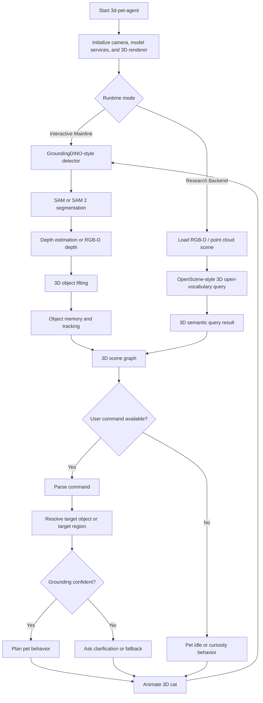
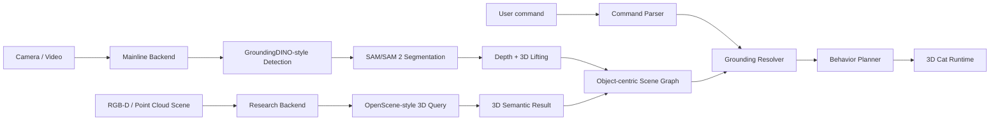
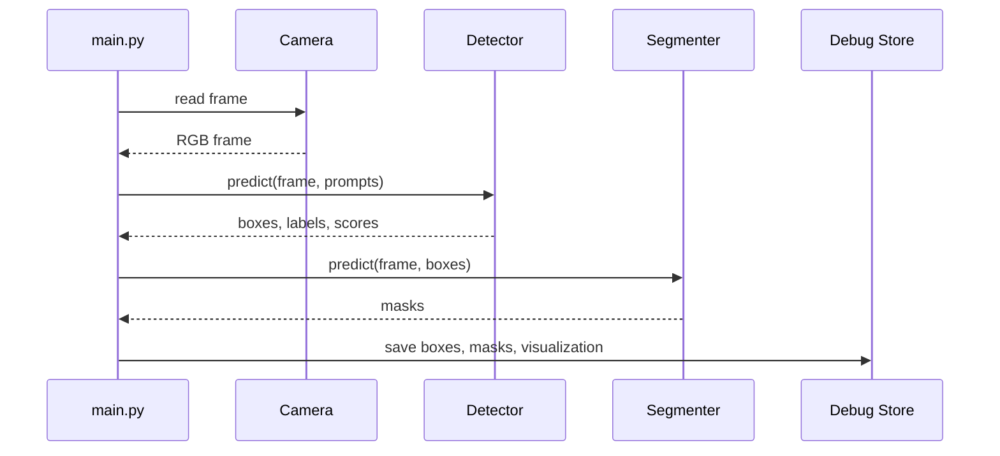
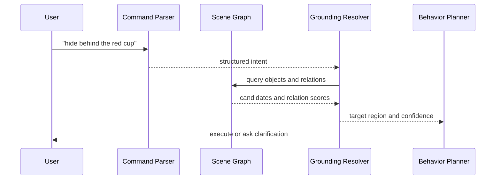

# Software Design Document: `3d-pet-agent`

> Iterative SDD. Each phase builds on the previous one. Implement in order.
>
> Project theme: A language-grounded full 3D computer pet, using mature vision models as perception backends and custom engineering layers for 3D scene graphs, spatial reasoning, behavior planning, and evaluation.
>
> Updated technical strategy: GroundingDINO + SAM/SAM 2 is the interactive mainline. OpenScene is an advanced research backend and comparison module.

---

## Table of Contents

1. [Project Overview](#1-project-overview)
   - [1.1 Goal](#11-goal)
   - [1.2 Scope](#12-scope)
   - [1.3 Non-Goals](#13-non-goals)
   - [1.4 Target Hardware](#14-target-hardware)
   - [1.5 Technical Positioning](#15-technical-positioning)
   - [1.6 Overall Execution Flow](#16-overall-execution-flow)
2. [Model Feasibility Analysis](#2-model-feasibility-analysis)
   - [2.1 GroundingDINO + SAM/SAM 2 Mainline](#21-groundingdino--samsam-2-mainline)
   - [2.2 OpenScene Research Backend](#22-openscene-research-backend)
   - [2.3 Practical Decision Matrix](#23-practical-decision-matrix)
   - [2.4 Final Strategy](#24-final-strategy)
3. [System Architecture](#3-system-architecture)
   - [3.1 Dual-Backend Architecture](#31-dual-backend-architecture)
   - [3.2 Core Modules](#32-core-modules)
   - [3.3 Runtime Modes](#33-runtime-modes)
   - [3.4 Data Contracts](#34-data-contracts)
4. [Phase 1: 3D Pet Runtime and Scene Sandbox](#4-phase-1-3d-pet-runtime-and-scene-sandbox)
5. [Phase 2: Interactive Mainline Perception](#5-phase-2-interactive-mainline-perception)
6. [Phase 3: Depth Estimation and 3D Object Lifting](#6-phase-3-depth-estimation-and-3d-object-lifting)
7. [Phase 4: Object Memory, Tracking, and Temporal Stability](#7-phase-4-object-memory-tracking-and-temporal-stability)
8. [Phase 5: 3D Scene Graph and Spatial Relation Reasoning](#8-phase-5-3d-scene-graph-and-spatial-relation-reasoning)
9. [Phase 6: Natural Language Command Parser and Grounding Resolver](#9-phase-6-natural-language-command-parser-and-grounding-resolver)
10. [Phase 7: 3D Pet Behavior Planner](#10-phase-7-3d-pet-behavior-planner)
11. [Phase 8: OpenScene Research Backend](#11-phase-8-openscene-research-backend)
12. [Phase 9: Dual-Backend Comparison and Integration](#12-phase-9-dual-backend-comparison-and-integration)
13. [Phase 10: Evaluation, Demo Protocol, and Report Assets](#13-phase-10-evaluation-demo-protocol-and-report-assets)
14. [Repository Structure](#14-repository-structure)
15. [Dependencies](#15-dependencies)
16. [Configuration](#16-configuration)
17. [Testing Strategy](#17-testing-strategy)
18. [Risks & Notes](#18-risks--notes)
19. [Recommended Development Schedule](#19-recommended-development-schedule)
20. [References](#20-references)

---

## 1. Project Overview

### 1.1 Goal

Build a complete 3D computer pet system named `3d-pet-agent`.

The system receives live RGB or RGB-D input and natural language commands, identifies objects in the real environment, estimates their 3D positions, builds an object-centric 3D scene graph, resolves commands such as "walk behind the red cup" or "hide between the keyboard and the box", and drives a 3D cat avatar to perform grounded spatial behaviors.

The final demo should show a virtual 3D cat interacting with a real desk or small room scene through a 3D renderer or browser-based overlay.

Primary user-facing examples:

```text
Go to the right side of the red cup.
Hide behind the keyboard.
Do not get close to the water bottle.
Look at the object I just placed on the table.
Find a safe place between the mouse and the box.
Which object are you looking at?
```

Core technical contribution:

```text
Convert open-vocabulary perception outputs into a stable 3D world model,
then ground natural language commands into executable pet behaviors.
```

### 1.2 Scope

The project focuses on five engineering problems:

1. Open-vocabulary visual grounding from text prompts.
2. Instance-level segmentation for object masks.
3. 3D lifting from masks and depth.
4. Object-centric 3D scene graph construction.
5. Language-conditioned pet behavior planning.

The project also includes a research extension:

```text
OpenScene-style open-vocabulary 3D scene understanding as a comparison backend.
```

### 1.3 Non-Goals

The project does not train a large vision-language foundation model from scratch.

The project does not promise centimeter-level metric reconstruction when only monocular depth is available.

The project does not attempt physical robot control during the first complete version.

The project does not call an LLM every frame. Language parsing happens on user command events, while perception and tracking run as separate loops.

The project does not make OpenScene the first implementation backbone. OpenScene is an advanced research backend after the interactive mainline works.

### 1.4 Target Hardware

| Component | Target |
|---|---|
| GPU | NVIDIA RTX 4070 12GB |
| CPU | Modern desktop CPU |
| RAM | 16GB minimum, 32GB recommended |
| Camera | Webcam, phone camera stream, or optional RGB-D camera |
| OS | Ubuntu preferred, Windows WSL2 acceptable with CUDA caveats |
| Renderer | Three.js, Unity, or Godot |
| Backend | Python service with WebSocket or HTTP API |

The RTX 4070 12GB is suitable for local inference with object detection, segmentation, depth estimation, and lightweight 3D rendering. It is not a realistic target for training a new large-scale 3D vision-language foundation model.

### 1.5 Technical Positioning

This project should be presented as a system engineering project with AI perception modules, not as a pure model training project.

A weak version would be:

```text
GroundingDINO -> SAM -> Depth model -> Cat moves
```

A strong version is:

```text
Open-vocabulary perception
-> instance masks
-> uncertainty-aware 3D object lifting
-> object memory
-> 3D scene graph
-> relation scoring
-> command parsing
-> grounding resolver
-> behavior planner
-> clarification and failure handling
-> quantitative evaluation
```

The engineering depth comes from the middle layers: state schemas, uncertainty handling, spatial relation scoring, temporal memory, behavior planning, and evaluation.

### 1.6 Overall Execution Flow



---

## 2. Model Feasibility Analysis

### 2.1 GroundingDINO + SAM/SAM 2 Mainline

#### Concept

GroundingDINO provides text-conditioned open-vocabulary object detection. SAM or SAM 2 converts detected boxes or prompts into instance masks. The system then uses depth estimation or RGB-D depth to lift object masks into approximate 3D object states.

```text
RGB frame
-> text-conditioned object detection
-> promptable instance segmentation
-> depth estimation
-> mask-level 3D projection
-> object-centric 3D scene graph
-> pet behavior
```

#### Why it is feasible

GroundingDINO is designed for open-set object detection and can detect arbitrary objects from human inputs such as category names or referring expressions. This directly matches commands like "red cup", "keyboard", or "object next to the mouse".

SAM is a promptable segmentation model that can produce masks from prompts such as boxes or points, which makes it a natural pair with a detector. SAM 2 extends promptable segmentation to both images and videos and includes streaming memory for video processing.

#### Strengths

| Area | Advantage |
|---|---|
| Demo feasibility | Fastest path to an interactive 3D pet demo |
| Debuggability | Intermediate outputs are visible as boxes, masks, depth maps, and object states |
| Modularity | Detection, segmentation, depth, tracking, graph reasoning, and planning can be developed independently |
| Hardware fit | Can be made practical on RTX 4070 12GB with update-rate control |
| Natural language grounding | Good for object names and referring expressions |
| Engineering depth | Leaves room for custom 3D lifting, scene graph, uncertainty, and planner layers |
| Video support | SAM 2 can support temporal segmentation and reduce mask flicker |

#### Weaknesses

| Area | Limitation |
|---|---|
| 3D native ability | The detector and segmenter operate primarily in 2D |
| Metric scale | Monocular depth is usually approximate without calibration |
| Spatial relations | Relations such as `behind`, `between`, and `safe region` must be implemented manually |
| Object identity | Object IDs may flicker across frames without tracking |
| Occlusion | Partial occlusion can degrade masks and depth statistics |
| Transparent objects | Cups, bottles, and reflective surfaces can produce unstable depth |

#### Project-owned engineering layers

This mainline becomes technically strong only if the following layers are implemented by the project:

```text
ObjectState schema
Depth statistics and uncertainty
Mask-to-point-cloud lifting
Temporal object memory
Scene graph edges
Spatial relation scorers
Target region generation
Behavior planning
Failure recovery
Evaluation dataset
```

### 2.2 OpenScene Research Backend

#### Concept

OpenScene-style systems map 3D scene points into a CLIP-aligned feature space. Text queries can score dense 3D points or regions directly.

```text
RGB-D frames / point cloud / reconstructed 3D scene
-> 3D point feature extraction
-> CLIP-aligned 3D feature space
-> open-vocabulary text query
-> 3D semantic relevancy map
-> object or region selection
```

#### Why it is valuable

OpenScene is closer to true open-vocabulary 3D scene understanding. Its central idea is to predict dense features for 3D scene points that are co-embedded with text and image pixels in CLIP feature space. This enables zero-shot and task-agnostic open-vocabulary queries over 3D scenes.

#### Strengths

| Area | Advantage |
|---|---|
| Research depth | Stronger alignment with modern 3D vision-language research |
| 3D-native representation | Text queries operate over 3D points rather than 2D boxes |
| Semantic heatmaps | Can return dense 3D relevance scores |
| Proposal quality | Good for explaining multimodal embeddings and 3D scene understanding |
| Comparison value | Useful as a second backend to compare against the object-centric pipeline |

#### Weaknesses

| Area | Limitation |
|---|---|
| Setup cost | Requires 3D data, point clouds, RGB-D frames, camera poses, or reconstruction |
| Live interaction | Harder to use as the real-time backbone for a pet agent |
| Debug complexity | Failures can come from pose, reconstruction, feature fusion, or text alignment |
| Runtime integration | Still needs object clustering, scene graph conversion, and behavior planning |
| Dataset assumptions | Many 3D scene methods are tested on indoor datasets, while this project uses arbitrary desk scenes |
| Schedule risk | High chance of spending too much time on preprocessing and environment issues |

### 2.3 Practical Decision Matrix

| Criterion | GroundingDINO + SAM/SAM 2 + Depth | OpenScene-style 3D Backend |
|---|---:|---:|
| Summer feasibility | High | Medium to Low |
| Live interaction | High | Low to Medium |
| 3D research depth | Medium | High |
| Engineering controllability | High | Medium to Low |
| Debuggability | High | Medium to Low |
| RTX 4070 suitability | High | Medium |
| Webcam compatibility | High | Low |
| RGB-D / point cloud requirement | Optional | Usually required |
| Scene graph integration | High | Medium |
| Best role | Mainline backend | Research backend |

### 2.4 Final Strategy

The project uses a hybrid plan:

```text
Fast Interactive Mode:
  GroundingDINO + SAM/SAM 2 + depth lifting + object-centric scene graph

Research 3D Semantic Mode:
  OpenScene-style backend for static or recorded 3D scenes

Comparison Mode:
  Evaluate both backends on query flexibility, latency, setup cost, and grounding success
```

This lets the project learn many areas without sacrificing the chance of a complete demo.

---

## 3. System Architecture

### 3.1 Dual-Backend Architecture



### 3.2 Core Modules

| Module | Responsibility |
|---|---|
| `camera_service` | Capture RGB frames from webcam, phone stream, video, or image |
| `detector_service` | Run text-conditioned object detection |
| `segmenter_service` | Produce instance masks from boxes or prompts |
| `depth_service` | Produce depth map from monocular model or RGB-D camera |
| `object_lifter` | Convert 2D masks and depth into 3D object states |
| `tracker_service` | Maintain object identity across frames |
| `scene_graph` | Store objects, attributes, relations, uncertainty, and history |
| `command_parser` | Convert natural language commands into structured intent |
| `grounding_resolver` | Match parsed command to object or target region |
| `behavior_planner` | Convert resolved target into pet actions |
| `pet_runtime` | Render and animate the 3D cat |
| `openscene_backend` | Optional static-scene open-vocabulary 3D query backend |
| `backend_compare` | Compare mainline and research backend outputs |
| `evaluation` | Measure grounding accuracy, relation accuracy, task success, and latency |

### 3.3 Runtime Modes

| Mode | Description | Purpose |
|---|---|---|
| `sandbox` | 3D pet runtime without perception | Validate pet movement and animations |
| `snapshot` | Run perception and grounding on one image | Unit test perception and resolver |
| `demo` | Live camera plus live pet runtime | Final interactive demo |
| `replay` | Run pipeline on recorded video | Reproducible debugging |
| `record` | Save frames, masks, object states, and commands | Dataset collection |
| `eval` | Run benchmark commands on recorded scenes | Quantitative evaluation |
| `openscene_static` | Run OpenScene-style query on prepared 3D data | Research backend demo |
| `compare_backends` | Compare mainline result against research backend | Technical analysis |

Example CLI:

```bash
python main.py --mode sandbox
python main.py --mode snapshot --image samples/desk.jpg --command "go to the red cup"
python main.py --mode demo --camera 0 --prompts configs/desk_prompts.txt
python main.py --mode replay --video samples/desk_scene.mp4 --commands samples/commands.jsonl
python main.py --mode openscene_static --scene data/scene_01 --query "chair"
python main.py --mode compare_backends --dataset eval/desk_queries.jsonl
```

### 3.4 Data Contracts

#### 3.4.1 `ObjectState`

```json
{
  "id": "cup_001",
  "label": "cup",
  "attributes": ["red", "small"],
  "bbox_xyxy": [412, 208, 522, 391],
  "mask_path": "runs/frame_0042/cup_001_mask.png",
  "center_2d": [467, 299],
  "center_3d": [0.32, 0.05, 1.21],
  "bbox_3d": {
    "min": [0.25, -0.02, 1.12],
    "max": [0.40, 0.16, 1.31]
  },
  "depth_median": 1.21,
  "depth_iqr": 0.14,
  "source_backend": "mainline_grounding_sam",
  "confidence": {
    "detector": 0.76,
    "mask_quality": 0.81,
    "depth_quality": 0.67,
    "tracking": 0.92,
    "overall": 0.78
  },
  "last_seen_frame": 42
}
```

#### 3.4.2 `SceneGraph`

```json
{
  "timestamp": 1720000000.0,
  "frame_id": 42,
  "coordinate_frame": "camera_relative",
  "objects": ["cup_001", "keyboard_001", "mouse_001"],
  "relations": [
    {
      "subject": "cup_001",
      "relation": "right_of",
      "object": "keyboard_001",
      "score": 0.83,
      "evidence": {
        "subject_center_3d": [0.32, 0.05, 1.21],
        "object_center_3d": [-0.14, 0.04, 1.19]
      }
    }
  ]
}
```

#### 3.4.3 `CommandIntent`

```json
{
  "raw_text": "hide behind the red cup but avoid the mouse",
  "intent": "hide",
  "target": {
    "class": "cup",
    "attributes": ["red"]
  },
  "relation": {
    "type": "behind",
    "anchor": "target"
  },
  "constraints": [
    {
      "type": "avoid",
      "class": "mouse"
    }
  ]
}
```

#### 3.4.4 `GroundingResult`

```json
{
  "status": "grounded",
  "target_object_id": "cup_001",
  "target_region_3d": [0.42, 0.00, 1.38],
  "score_breakdown": {
    "semantic_match": 0.92,
    "attribute_match": 0.83,
    "relation_match": 0.77,
    "spatial_feasibility": 0.71,
    "perception_confidence": 0.78
  },
  "final_score": 0.81,
  "explanation": "Selected cup_001 because it is detected as a red cup and the target region behind it is not blocked."
}
```

#### 3.4.5 `PetAction`

```json
{
  "action": "move_to",
  "target_position_3d": [0.42, 0.00, 1.38],
  "look_at_object_id": "cup_001",
  "animation": "walk",
  "speed": 0.8,
  "constraints": ["avoid_mouse_001"],
  "fallback": "ask_clarification"
}
```

---

## 4. Phase 1: 3D Pet Runtime and Scene Sandbox

### 4.1 Requirements

- Create a 3D cat avatar runtime.
- Support a placeholder cat model first, then replace it with a rigged cat model.
- Support basic actions: `idle`, `walk`, `look_at`, `sit`, `hide`, `curious`, `confused`.
- Support command-driven movement to manually supplied 3D coordinates.
- Render debug axes, floor grid, target points, and object markers.
- Expose a backend API for pet actions.

### 4.2 CLI Interface

```bash
python main.py --mode sandbox
python main.py --mode sandbox --target 0.5 0.0 1.2
python main.py --mode sandbox --script samples/pet_actions.jsonl
```

### 4.3 Runtime API

```python
pet.move_to(x: float, y: float, z: float) -> None
pet.look_at(x: float, y: float, z: float) -> None
pet.play_animation(name: str) -> None
pet.set_emotion(name: str) -> None
pet.ask(text: str) -> None
```

### 4.4 Logic Flow

```text
initialize renderer
load cat model
load empty scene
render world axes and floor grid
if target coordinate specified:
    move cat to target
else:
    play idle animation
show current state in debug panel
```

### 4.5 Acceptance Criteria

- The cat can be rendered and controlled in a 3D scene.
- The cat can move to a specified coordinate.
- The cat can look at a specified point.
- The runtime can receive action commands from Python.
- The renderer can display debug markers for target points.

---

## 5. Phase 2: Interactive Mainline Perception

### 5.1 Requirements

- Capture live RGB frames from webcam or load frames from file.
- Detect objects using text prompts.
- Segment detected object instances.
- Save per-frame detection and mask outputs for debugging.
- Support a default prompt vocabulary for desk and room scenes.
- Run the perception pipeline independently from the pet runtime.

### 5.2 Default Prompt Vocabulary

```text
cup, bottle, keyboard, mouse, laptop, phone, book, box, chair, table, person, hand, cable, pen, notebook, bag, monitor, speaker, plant, toy
```

### 5.3 Detection and Segmentation Logic

```text
frame = camera.read()
prompts = load_prompt_set()
boxes = detector.predict(frame, prompts)
masks = segmenter.predict(frame, boxes)
objects_2d = build_object_candidates(boxes, masks)
filter low-confidence detections
save debug visualization
```

### 5.4 Output Format

```json
{
  "frame_id": 12,
  "objects_2d": [
    {
      "id": "obj_tmp_01",
      "label": "cup",
      "bbox_xyxy": [412, 208, 522, 391],
      "mask_path": "runs/frame_0012/obj_tmp_01.png",
      "detector_confidence": 0.76,
      "mask_quality": 0.81
    }
  ]
}
```

### 5.5 Sequence Diagram



### 5.6 Acceptance Criteria

- The system detects and segments at least 5 common desk objects.
- Detection results are saved as JSON.
- Mask visualizations are saved for inspection.
- Perception output can be replayed without the original models.
- The system can run in `snapshot` mode for reproducible tests.

---

## 6. Phase 3: Depth Estimation and 3D Object Lifting

### 6.1 Requirements

- Generate a depth map for each RGB frame.
- Support monocular depth and optional RGB-D camera depth.
- Compute object-level depth statistics from each mask.
- Lift each object into approximate 3D coordinates.
- Represent uncertainty explicitly.
- Mark outputs as `metric_3d` or `relative_3d` based on calibration quality.

### 6.2 Camera Model

For each pixel `(u, v)` with depth `Z`, lift it to 3D using camera intrinsics:

```text
X = (u - cx) * Z / fx
Y = (v - cy) * Z / fy
Z = depth(u, v)
```

If camera intrinsics are unavailable, use normalized coordinates and label the output as relative 3D.

### 6.3 Depth Aggregation

For each object mask:

```python
depth_values = depth_map[mask == 1]
depth_values = remove_invalid_values(depth_values)
depth_median = median(depth_values)
depth_iqr = percentile(depth_values, 75) - percentile(depth_values, 25)
```

Use median instead of mean because segmentation boundaries, reflections, and transparent objects can produce unstable depth outliers.

### 6.4 Logic Flow

```text
load RGB frame
load object masks
run depth model or read RGB-D depth
for each object:
    collect depth values inside mask
    remove invalid and extreme values
    compute median depth and IQR
    lift mask center and sampled mask pixels into 3D
    estimate 3D bounding box
    attach uncertainty score
```

### 6.5 Acceptance Criteria

- Each detected object has `center_3d`, `depth_median`, and `depth_iqr`.
- The system can visually show object centers in a 3D debug view.
- Objects with high depth uncertainty are marked as low-confidence.
- A saved frame can be reprocessed and produce deterministic object state JSON.

---

## 7. Phase 4: Object Memory, Tracking, and Temporal Stability

### 7.1 Requirements

- Maintain object IDs across frames.
- Smooth object positions and depth estimates.
- Detect newly appeared objects.
- Reduce flickering masks and relation changes.
- Keep short-term scene memory.
- Support SAM 2-style video segmentation when available.

### 7.2 Tracking Strategy

Object association should use:

```text
IoU of masks or boxes
+ class label match
+ 2D center distance
+ 3D center distance
+ depth consistency
+ optional visual embedding similarity
```

### 7.3 Temporal Smoothing

```python
smoothed_center_3d = alpha * current_center_3d + (1 - alpha) * previous_center_3d
smoothed_depth = median(depth_history[-N:])
smoothed_confidence = beta * current_confidence + (1 - beta) * previous_confidence
```

### 7.4 New Object Detection

An object is considered new if:

```text
no existing tracked object matches it
and confidence > threshold
and it persists for at least K frames
```

### 7.5 Acceptance Criteria

- Object IDs remain stable for at least 10 seconds under minor camera movement.
- The pet can react to newly placed objects.
- Scene graph flicker is visibly reduced.
- Tracking confidence is stored in `ObjectState`.

---

## 8. Phase 5: 3D Scene Graph and Spatial Relation Reasoning

### 8.1 Requirements

- Build a scene graph from object states.
- Compute spatial relations among objects.
- Support relation queries from the command parser.
- Maintain explainable relation scores.
- Store relation evidence for debugging.

### 8.2 Supported Relations

| Relation | Rule Source | Description |
|---|---|---|
| `left_of` | 2D/3D center x | Subject is left of object |
| `right_of` | 2D/3D center x | Subject is right of object |
| `above` | 2D/3D center y | Subject is above object |
| `below` | 2D/3D center y | Subject is below object |
| `in_front_of` | depth z | Subject is closer to camera |
| `behind` | depth z | Subject is farther from camera |
| `near` | 3D distance | Subject is close to object |
| `between` | geometric region | Subject lies between two anchors |
| `occluding` | mask overlap plus depth | Subject may occlude object |
| `safe_region_near` | occupancy map | Region is navigable for pet |

### 8.3 Relation Scoring

Each relation returns a score in `[0, 1]`.

```python
score_right_of(A, B) = sigmoid((A.center_3d.x - B.center_3d.x) / threshold_x)
score_near(A, B) = exp(-distance(A, B) / sigma)
score_behind(A, B) = sigmoid((A.center_3d.z - B.center_3d.z) / threshold_z)
```

### 8.4 Occupancy Map

For pet movement, project object regions into a simplified navigation plane.

```text
3D object bounding boxes
-> blocked regions
-> candidate safe points
-> target region selection
```

### 8.5 Acceptance Criteria

- The system can answer relation queries such as:

```text
Which objects are near the cup?
What is right of the keyboard?
Is the mouse in front of the laptop?
Where can the cat hide?
```

- Relation decisions are explainable through coordinates, scores, and object IDs.
- Scene graph can be exported as JSON.
- The graph can be replayed without running the vision models.

---

## 9. Phase 6: Natural Language Command Parser and Grounding Resolver

### 9.1 Requirements

- Parse user commands into structured intent.
- Resolve target object or target region from the scene graph.
- Support ambiguity handling.
- Support deterministic fallback for common commands.
- Avoid calling an LLM every video frame.
- Log raw command, parsed intent, grounding result, and executed action.

### 9.2 Supported Intents

| Intent | Example | Output |
|---|---|---|
| `move_to_object` | Go to the cup | Object target |
| `move_to_relation` | Go to the right of the cup | Region target |
| `hide` | Hide behind the keyboard | Region behind anchor |
| `avoid` | Do not go near the bottle | Constraint |
| `look_at` | Look at the red box | Gaze target |
| `follow_new_object` | Look at what I just placed | Temporal novelty target |
| `ask_clarification` | Which cup do you mean? | Dialog action |

### 9.3 Command Parser Output

```json
{
  "intent": "move_to_relation",
  "target": {
    "class": "cup",
    "attributes": ["red"]
  },
  "relation": {
    "type": "right_of",
    "anchor": "target"
  },
  "constraints": []
}
```

### 9.4 Grounding Resolver Scoring

For each candidate object or region:

```text
final_score =
  0.35 * semantic_match
+ 0.20 * attribute_match
+ 0.20 * relation_match
+ 0.15 * spatial_feasibility
+ 0.10 * perception_confidence
```

If the highest score is below `GROUNDING_THRESHOLD`, the system should ask for clarification or explain what it found.

### 9.5 Failure Handling

| Failure | Behavior |
|---|---|
| No target found | Ask user to rephrase or list visible alternatives |
| Multiple similar targets | Ask disambiguation question |
| Target visible but depth unreliable | Move in 2D overlay mode or ask user to adjust camera |
| Target region blocked | Choose nearest safe region and explain fallback |
| Relation impossible | Refuse the action and give reason |
| Backend disagreement | Ask clarification or prefer safer target |

### 9.6 Sequence Diagram



### 9.7 Acceptance Criteria

- At least 20 predefined natural language commands are supported.
- At least 5 ambiguous or failure cases are handled safely.
- Parsed command JSON is logged for evaluation.
- The resolver can explain why it selected a target.

---

## 10. Phase 7: 3D Pet Behavior Planner

### 10.1 Requirements

- Convert grounded targets into pet actions.
- Support navigation on a simplified 3D floor or table plane.
- Support behavior-specific animations.
- Support obstacle avoidance using object masks and projected 3D regions.
- Ask clarification instead of moving when grounding is unsafe.

### 10.2 Pet Behavior States

| State | Description |
|---|---|
| `idle` | Pet waits or performs small random movements |
| `curious` | Pet looks at newly detected object |
| `walking` | Pet moves toward target |
| `sitting` | Pet sits near target |
| `hiding` | Pet moves behind an anchor object |
| `avoiding` | Pet reroutes around unsafe object |
| `confused` | Pet cannot ground command and asks clarification |

### 10.3 Behavior Planning Logic

```text
input: CommandIntent + GroundingResult + SceneGraph
if grounding confidence is low:
    return confused / ask clarification
if target is object:
    compute approach point near object
if target is relation:
    compute relation-specific region
if constraints exist:
    remove unsafe candidate regions
plan smooth path
send movement and animation commands to renderer
```

### 10.4 Target Region Rules

| Command | Target Position Rule |
|---|---|
| `go to cup` | nearest safe point around cup |
| `go right of cup` | cup center plus positive x offset |
| `hide behind cup` | cup center plus positive z offset relative to camera or world anchor |
| `avoid bottle` | mark bottle area as blocked |
| `between A and B` | midpoint between A and B if safe |
| `look at A` | pet gaze target equals A center |

### 10.5 Acceptance Criteria

- The pet can move to object-relative positions.
- The pet can refuse or reroute around blocked regions.
- The pet animation matches the intended action.
- The pet can ask a clarification question when needed.

---

## 11. Phase 8: OpenScene Research Backend

### 11.1 Requirements

- Prepare at least one static RGB-D or point-cloud scene.
- Run an OpenScene-style open-vocabulary 3D query pipeline.
- Query 3D points or regions using text.
- Export 3D semantic query results into a common format usable by the scene graph.
- Keep this backend separate from the live demo until the mainline works.

### 11.2 Input Options

| Input Type | Use Case |
|---|---|
| Public indoor 3D scene dataset | Fastest path to reproduce OpenScene-style behavior |
| Recorded RGB-D desk scene | Closer to project demo, requires camera and preprocessing |
| Reconstructed point cloud from video | Strong research value, highest setup risk |

### 11.3 Query Examples

```text
chair
table
place to hide
object made of metal
soft object
openable object
```

### 11.4 Output Contract

```json
{
  "scene_id": "static_scene_01",
  "query": "chair",
  "backend": "openscene",
  "semantic_points": [
    {
      "xyz": [0.31, 0.48, 1.22],
      "score": 0.87
    }
  ],
  "clusters": [
    {
      "cluster_id": "cluster_001",
      "label": "chair",
      "centroid_3d": [0.35, 0.50, 1.24],
      "score": 0.83
    }
  ]
}
```

### 11.5 Conversion to Scene Graph

```text
3D semantic points
-> cluster high-score points
-> estimate cluster centroid and extent
-> convert cluster to ObjectState
-> insert into SceneGraph with source_backend = "openscene"
```

### 11.6 Acceptance Criteria

- The backend can run at least 5 text queries over a prepared 3D scene.
- Query results can be visualized as 3D heatmaps or colored point clusters.
- At least one OpenScene result is converted into `ObjectState` format.
- The backend can be compared against the mainline on static scenes.

---

## 12. Phase 9: Dual-Backend Comparison and Integration

### 12.1 Requirements

- Compare mainline backend and research backend on equivalent queries.
- Measure latency, setup cost, query flexibility, and grounding success.
- Identify cases where object-centric lifting works better.
- Identify cases where OpenScene-style dense 3D semantics works better.
- Present the comparison in the final report.

### 12.2 Comparison Protocol

```text
for each static scene:
    run mainline perception if RGB frames are available
    run OpenScene-style query if 3D data is available
    normalize outputs into ObjectState or SemanticRegion
    run same command through GroundingResolver
    compare target selection and explanation
```

### 12.3 Comparison Metrics

| Metric | Definition |
|---|---|
| Query success | Whether the backend returns a relevant object or region |
| Localization quality | Whether target position matches annotation |
| Latency | Query time or end-to-end processing time |
| Setup effort | Required preprocessing steps |
| Debuggability | Ability to inspect failures |
| Integration cost | Work required to feed result into behavior planner |
| Failure mode | Categorized reason for wrong or missing result |

### 12.4 Expected Findings

| Scenario | Likely Better Backend | Reason |
|---|---|---|
| Live webcam desk interaction | Mainline | Lower setup cost and easier live processing |
| Static 3D semantic query | OpenScene | Native 3D point features |
| Common object command | Mainline | Strong 2D detection and segmentation |
| Vague semantic query | OpenScene | Dense CLIP-aligned features may support broader concepts |
| Behavior planning | Mainline | Object states and scene graph are easier to control |

### 12.5 Acceptance Criteria

- The report includes a table comparing both backends.
- At least 10 queries are tested on the mainline backend.
- At least 5 queries are tested on the OpenScene backend if setup succeeds.
- The project clearly states why the mainline is used for the final live demo.

---

## 13. Phase 10: Evaluation, Demo Protocol, and Report Assets

### 13.1 Requirements

- Provide quantitative evaluation.
- Provide reproducible demo scenes.
- Provide failure case analysis.
- Provide architecture diagrams and demo video.
- Report both successful and failed examples.

### 13.2 Evaluation Dataset

Create a small local benchmark:

```text
10 desk scenes
5 room or table arrangements
50 natural language commands
at least 10 ambiguous or failure commands
```

Each test sample should include:

```json
{
  "scene_id": "desk_03",
  "command": "hide behind the red cup",
  "expected_object": "cup_red_01",
  "expected_relation": "behind",
  "expected_behavior": "hide",
  "success_criteria": "pet target position is behind the red cup and not inside obstacle mask"
}
```

### 13.3 Metrics

| Metric | Definition |
|---|---|
| Detection Recall | Whether target object is detected |
| Mask Quality Proxy | Mask stability and visible overlap check |
| Depth Stability | IQR and frame-to-frame depth variance |
| Tracking Stability | Whether object IDs remain consistent |
| Relation Accuracy | Whether relation decision matches annotation |
| Grounding Accuracy | Whether selected target matches expected object or region |
| Task Success Rate | Whether final pet behavior satisfies command |
| Clarification Quality | Whether system asks instead of executing unsafe or ambiguous command |
| Latency | Time from command to action |
| Perception FPS | Effective perception update rate |
| Backend Agreement | Whether mainline and research backend select the same target |

### 13.4 Demo Protocol

```text
1. Start application in live demo mode.
2. Show empty scene with idle cat.
3. Place 3 to 5 common objects on desk.
4. Show detected masks and 3D object centers.
5. Issue simple command: "go to the cup".
6. Issue relational command: "hide behind the keyboard".
7. Issue constraint command: "go to the box but avoid the bottle".
8. Issue ambiguous command: "go to the cup" when two cups are visible.
9. Show clarification behavior.
10. Show metrics dashboard or saved logs.
11. Optionally show OpenScene static-scene query comparison.
```

### 13.5 Final Report Assets

- `README.md`
- `spec.md`
- Architecture diagram
- Module sequence diagram
- Demo video
- Evaluation table
- Failure case gallery
- Model comparison section
- Backend comparison table
- Technical limitations section

---

## 14. Repository Structure

```text
3d-pet-agent/
  README.md
  spec.md
  requirements.txt
  pyproject.toml
  main.py
  configs/
    prompts.txt
    camera.yaml
    models.yaml
    thresholds.yaml
    runtime.yaml
  assets/
    cat_model/
    textures/
    sounds/
  src/
    camera_service/
      webcam.py
      video_reader.py
      phone_stream.py
    perception/
      detector.py
      segmenter.py
      depth.py
      pipeline.py
    spatial/
      object_lifter.py
      scene_graph.py
      relation_scorer.py
      occupancy.py
    tracking/
      tracker.py
      memory.py
      smoothing.py
    language/
      command_parser.py
      prompt_templates.py
      fallback_rules.py
      schema.py
    planning/
      grounding_resolver.py
      behavior_planner.py
      path_planner.py
    runtime/
      pet_runtime.py
      renderer_bridge.py
      websocket_server.py
    research/
      openscene_backend.py
      pointcloud_utils.py
      backend_compare.py
    evaluation/
      dataset.py
      metrics.py
      run_eval.py
      report_tables.py
  frontend/
    package.json
    src/
      App.vue
      renderer/
      debug_panel/
  samples/
    images/
    videos/
    commands.jsonl
  eval/
    scenes/
    annotations.jsonl
  runs/
    debug_outputs/
  tests/
    test_parser.py
    test_relations.py
    test_grounding.py
    test_object_lifter.py
    test_behavior_planner.py
```

---

## 15. Dependencies

### 15.1 Python Core

```text
torch
torchvision
opencv-python
numpy
scipy
pydantic
pyyaml
pillow
matplotlib
websockets
fastapi
uvicorn
```

### 15.2 Vision Models

```text
GroundingDINO or compatible open-vocabulary detector
SAM or SAM 2 compatible segmenter
Depth Anything V2 or compatible monocular depth model
Optional: CLIP or SigLIP for re-ranking visual-text matches
Optional: OpenScene research backend dependencies
```

### 15.3 3D Runtime Options

| Runtime | Pros | Cons |
|---|---|---|
| Three.js + WebSocket | Fits web skills, easy debug UI, fast iteration | 3D animation tools less mature than Unity |
| Unity | Strong 3D animation ecosystem | Python integration requires bridge |
| Godot | Lightweight and open-source | Smaller AI integration ecosystem |

Recommended first implementation:

```text
Three.js frontend + Python backend via WebSocket
```

Reason:

```text
A browser-based debug UI can show camera frames, masks, depth maps, scene graph, and pet animation in one place.
```

---

## 16. Configuration

### 16.1 `configs/models.yaml`

```yaml
detector:
  name: groundingdino
  device: cuda
  box_threshold: 0.35
  text_threshold: 0.25

segmenter:
  name: sam2
  device: cuda
  model_size: base

depth:
  name: depth_anything_v2
  device: cuda
  mode: relative

openscene:
  enabled: false
  scene_root: data/openscene
```

### 16.2 `configs/thresholds.yaml`

```yaml
grounding:
  min_final_score: 0.65
  ambiguity_margin: 0.12

tracking:
  min_iou: 0.35
  max_center_distance: 0.20
  persistence_frames: 3

relations:
  near_sigma: 0.50
  right_left_threshold: 0.08
  behind_front_threshold: 0.10

behavior:
  safe_distance: 0.15
  default_speed: 0.8
```

### 16.3 `configs/runtime.yaml`

```yaml
runtime:
  perception_update_hz: 2
  tracking_update_hz: 10
  renderer_fps: 60
  save_debug_outputs: true
  ask_clarification: true
```

---

## 17. Testing Strategy

### 17.1 Unit Tests

| Test | Target |
|---|---|
| `test_parser.py` | Command parser output schema |
| `test_relations.py` | Spatial relation scoring |
| `test_grounding.py` | Candidate scoring and ambiguity detection |
| `test_object_lifter.py` | 2D mask and depth to 3D point conversion |
| `test_behavior_planner.py` | Target region and action generation |

### 17.2 Integration Tests

| Test | Target |
|---|---|
| Snapshot perception test | Image to objects JSON |
| Scene graph replay test | Objects JSON to relation graph |
| Command grounding test | Command plus scene graph to target |
| Runtime bridge test | Pet action JSON to renderer movement |
| End-to-end replay test | Video plus commands to executed actions |

### 17.3 Regression Data

Store debug outputs for every milestone:

```text
runs/
  phase2_detection/
  phase3_depth_lifting/
  phase5_scene_graph/
  phase6_grounding/
  phase10_eval/
```

---

## 18. Risks & Notes

### 18.1 Technical Risks

| Risk | Description | Mitigation |
|---|---|---|
| Monocular depth is not metric | Relative depth may not match real scale | Use calibration, normalized 3D, or optional RGB-D camera |
| Detection misses target | Open-vocabulary detector may fail on unusual objects | Maintain prompt vocabulary, re-query, ask clarification |
| Mask flicker | Segmentation changes across frames | Add tracking, temporal smoothing, or SAM 2 video mode |
| LLM overuse | Calling LLM every frame causes latency and cost | Parse only on user command and use deterministic fallback |
| 3D pet looks detached from scene | Poor calibration between camera and renderer | Start with tabletop plane assumption and visible debug markers |
| OpenScene setup cost | Native 3D open-vocabulary pipeline may consume project time | Keep as optional research comparison after mainline works |
| Ambiguous natural language | User may refer to objects that are not uniquely identifiable | Ask clarification instead of guessing |
| Transparent or reflective objects | Depth and masks may be unstable | Mark low confidence and use fallback behavior |

### 18.2 Project Risks

| Risk | Symptom | Action |
|---|---|---|
| Too much model chasing | Many repos installed, no working pet | Freeze model choices after Phase 2 |
| No evaluation | Demo looks good once, but quality is unknown | Build evaluation commands by Phase 5 |
| OpenScene consumes schedule | Static 3D backend blocks main demo | Start OpenScene only after Phase 7 |
| Overly complex frontend | Pet UI absorbs perception time | Use placeholder cat and debug UI first |

### 18.3 Success Definition

The project is successful if it can reliably demonstrate the following:

```text
The user gives a natural language command.
The system identifies the referenced object or region.
The system explains the grounding decision.
The 3D cat performs the corresponding spatial behavior.
The system asks clarification when grounding is unsafe or ambiguous.
The project reports measurable performance and failure cases.
```

---

## 19. Recommended Development Schedule

### 19.1 Eight-Week Plan

| Week | Focus | Deliverable |
|---|---|---|
| 1 | 3D pet sandbox | Cat moves to manual 3D targets |
| 2 | Detection and segmentation | Snapshot mode with boxes and masks |
| 3 | Depth and 3D lifting | Objects have approximate 3D states |
| 4 | Scene graph and relations | Relation queries work on saved scenes |
| 5 | Command parser and resolver | Commands ground to objects or regions |
| 6 | Behavior planner | Cat performs move, look, hide, avoid |
| 7 | Tracking and robustness | Stable IDs, clarification, replay mode |
| 8 | Evaluation and report | Demo video, metrics, failure analysis |

### 19.2 Optional Extension Weeks

| Extension | Focus | Deliverable |
|---|---|---|
| 9 | OpenScene static backend | Text queries over prepared 3D scene |
| 10 | Dual-backend comparison | Mainline vs OpenScene report table |
| 11 | Better 3D calibration | Camera intrinsics and tabletop plane calibration |
| 12 | Frontend polish | Better pet model, animations, UI dashboard |

### 19.3 Cut Rules

If time is limited, cut in this order:

```text
1. OpenScene backend
2. Advanced pet animations
3. Multi-view reconstruction
4. CLIP re-ranking
5. RGB-D camera support
```

Do not cut these:

```text
1. Mainline perception
2. 3D object state schema
3. Scene graph
4. Command resolver
5. Behavior planner
6. Evaluation
```

---

## 20. References

- Grounding DINO: Marrying DINO with Grounded Pre-Training for Open-Set Object Detection. https://arxiv.org/abs/2303.05499
- Segment Anything. https://arxiv.org/abs/2304.02643
- SAM 2: Segment Anything in Images and Videos. https://arxiv.org/abs/2408.00714
- Segment Anything GitHub repository. https://github.com/facebookresearch/segment-anything
- SAM 2 GitHub repository. https://github.com/facebookresearch/sam2
- OpenScene: 3D Scene Understanding with Open Vocabularies. https://arxiv.org/abs/2211.15654
- OpenScene project page. https://pengsongyou.github.io/openscene
- OpenScene GitHub repository. https://github.com/pengsongyou/openscene
- Depth Anything V2: A More Capable, Faster and More Efficient Monocular Depth Estimation Model. https://arxiv.org/abs/2406.09414
